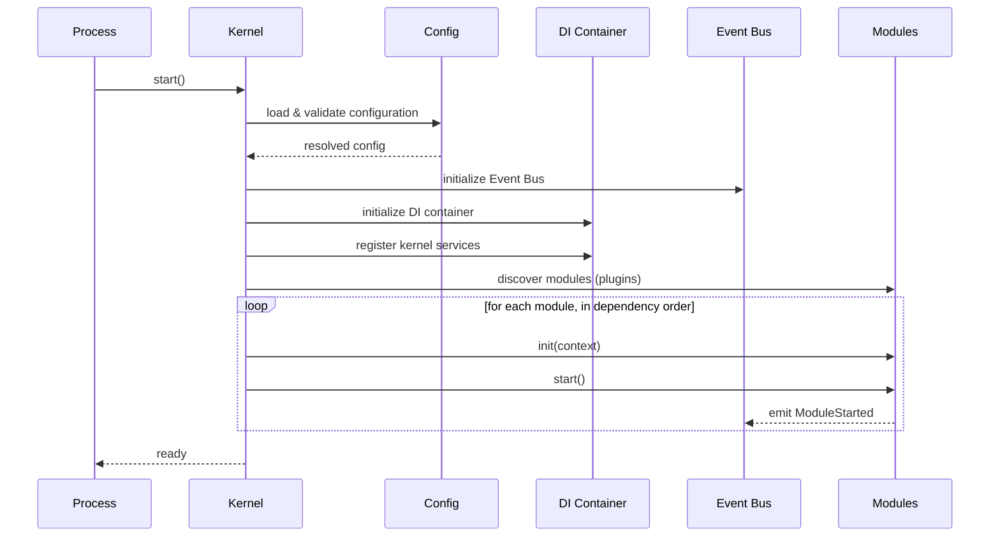
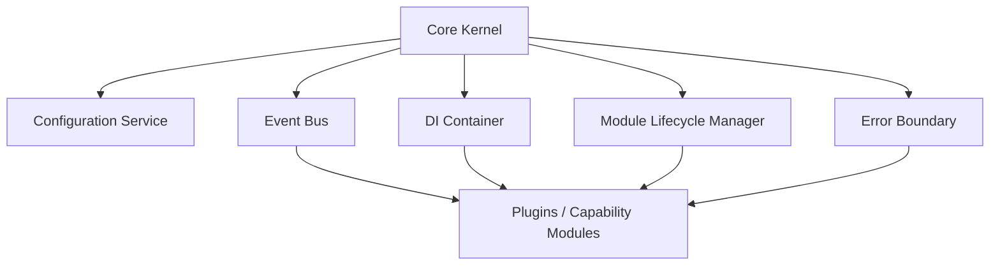
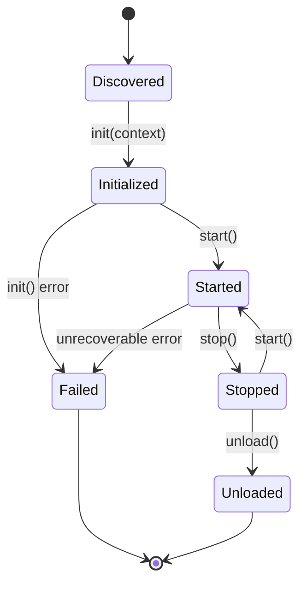

# 010_Core_Kernel

Status: Draft

Version: 0.1

Owner: PAIOS

---

## Purpose

The Core Kernel is the minimal, stable center of PAIOS. Per the
[Constitution](000_Project_Constitution.md)'s Plugin-First principle, the
kernel does as little as possible itself: it boots the system, wires
interfaces together, and gets out of the way. Almost all user-visible
capability lives in plugins that run on top of it. This document defines
what the kernel is responsible for, how it starts up, and the internal
services it exposes to everything else.

---

## Core Kernel Responsibilities

The kernel owns exactly the responsibilities that cannot be delegated to a
plugin without creating a circular dependency or an unstable foundation:

- **Boot orchestration** — bringing the system from process start to a
  ready state in a well-defined order.
- **Configuration loading** — reading and validating system configuration
  before any service depends on it.
- **Dependency injection** — constructing services and plugins against
  interfaces, never concrete types.
- **Event Bus** — the single, in-process transport for all event-driven
  communication (see [040_Event_Model](040_Event_Model.md) for event
  schemas).
- **Module lifecycle management** — loading, starting, stopping, and
  unloading plugins and kernel services in a predictable order.
- **Error boundaries** — containing failures so that one module's fault
  cannot silently corrupt or crash the rest of the system.

Everything else — memory backends, AI providers, capability plugins,
workflows — is built on top of these primitives, not inside them. If a
proposed feature is not one of the responsibilities above, it does not
belong in the kernel.

---

## Boot Lifecycle

The kernel boots in fixed, sequential phases. Later phases may assume
earlier phases have fully completed; a phase failure halts boot rather
than continuing in a degraded, undefined state.

Phases:

1. **Configuration** — configuration sources are loaded and validated
   against their schemas. No service starts on unvalidated configuration.
2. **Core service init** — the Event Bus and DI container are created
   first, since every later phase depends on them.
3. **Module discovery** — installed modules (kernel services and plugins)
   are enumerated and ordered by declared dependencies.
4. **Module init/start** — each module is constructed via the DI
   container, initialized, and started in dependency order. A module
   failing to start does not silently disable itself; boot halts and the
   failure is reported.
5. **Ready** — the kernel signals readiness only once every required
   module has started successfully.

Shutdown reverses this order: modules are stopped last-started-first,
then core services are torn down.

---

## Kernel Services

Kernel services are the small set of built-in capabilities that plugins
are written against. They are part of the kernel because the system
cannot function, or cannot function safely, without them.

- **Configuration Service** — resolves and validates configuration.
- **DI Container** — resolves interfaces to concrete implementations.
- **Event Bus** — routes events between publishers and subscribers.
- **Module Lifecycle Manager** — drives init/start/stop/unload for every
  module.
- **Error Boundary** — isolates and reports faults per module.

No kernel service depends on a plugin. Plugins may depend on any kernel
service through its published interface only.

---

## Event Bus

The Event Bus is the kernel's implementation of the Constitution's
Event-Driven Architecture principle: components communicate by emitting
and subscribing to events rather than calling each other directly.

- The kernel provides one in-process Event Bus instance, injected into
  every module through the DI container.
- Publishers emit events; they do not know or care who, if anyone,
  subscribes.
- Subscribers register interest in an event type; the bus delivers
  matching events in the order they were published.
- Every event has a documented schema and version, owned by a single
  producer, as required by the Constitution's coding standards. The
  concrete event schemas live in
  [040_Event_Model](040_Event_Model.md); the kernel only defines the
  transport, not the vocabulary of events.
- The bus is transport only: it does not persist events. Durable event
  history, if needed, is a plugin concern (e.g. an event-log plugin
  backed by the memory layer), not a kernel one.

---

## Dependency Injection

All kernel services and plugins are constructed through dependency
injection, never instantiated directly by their consumers. This is the
mechanical enforcement of the Constitution's Interface-First and
Dependency Inversion principles.

- Every injectable component is registered against an interface (abstract
  class, protocol, or trait), not a concrete class.
- The DI container resolves dependencies at module init time, based on
  the constructor/factory's declared interface requirements.
- Consumers depend only on the interface type; the container decides
  which implementation satisfies it at runtime (e.g. which AI provider
  adapter, which storage backend).
- Swapping an implementation (a different memory backend, a different AI
  provider) means changing what is registered in the container, not
  changing any consuming code.

---

## Configuration

Configuration is loaded and validated once, during the boot lifecycle's
Configuration phase, before any other kernel service starts.

- Configuration sources (files, environment, defaults) are merged in a
  defined precedence order.
- The merged result is validated against a schema before it is exposed to
  any module; invalid configuration halts boot rather than starting the
  system in an unknown state.
- Modules read configuration through the Configuration Service interface;
  no module reads environment variables or config files directly.
- Configuration is treated as read-only after boot. Runtime behavior
  changes go through explicit, event-driven mechanisms, not mutation of
  the loaded configuration object.

---

## Module Lifecycle

A module is anything managed by the kernel's Module Lifecycle Manager:
both built-in kernel services and external plugins share the same
lifecycle contract.

- **Discovered** — the module is known to the kernel but not yet
  constructed.
- **Initialized** — the module has been constructed via DI and given its
  context (configuration, Event Bus handle, logger), but has not yet
  begun operating.
- **Started** — the module is actively running: subscribed to events,
  serving requests, holding resources.
- **Stopped** — the module has released active resources but retains its
  initialized state, and can be restarted.
- **Unloaded** — the module and its resources are fully released; it must
  be reinitialized to run again.
- **Failed** — the module hit an unrecoverable error during init or while
  running; it is isolated by the Error Boundary and reported rather than
  allowed to affect other modules.

Dependency order is respected on both start (dependencies first) and stop
(dependents first).

---

## Error Boundaries

Per the Constitution, errors are handled at system boundaries; the kernel
treats each module boundary as one such boundary.

- Every module runs behind an Error Boundary that catches unhandled
  faults from that module's init, start, stop, and event-handling code
  paths.
- A module failure is contained to that module: it transitions to
  `Failed` and emits a fault event; it does not crash the kernel process
  or other modules.
- The kernel does not add defensive error handling for conditions that
  cannot occur internally (e.g. a DI container returning an
  unregistered interface is a programming error, not a handled case); it
  guards true boundaries — plugin code, I/O, and external provider calls.
- Repeated or unrecoverable faults in a module are surfaced to the
  operator/user rather than retried silently forever.

---

## Future Work

- Define the concrete module manifest format (declared dependencies,
  interface requirements) used during module discovery.
- Specify hot-reload semantics for plugins during development versus the
  stricter boot-time-only loading used in production.
- Define the fault event schema emitted by the Error Boundary and its
  consumers (e.g. a health-reporting plugin).
- Evaluate whether a supervised-restart policy (per module) belongs in
  the kernel or as an optional plugin.

---
