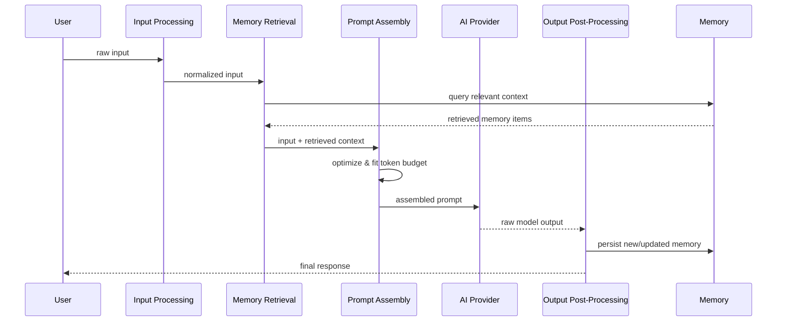
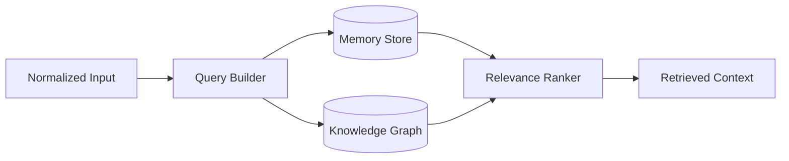
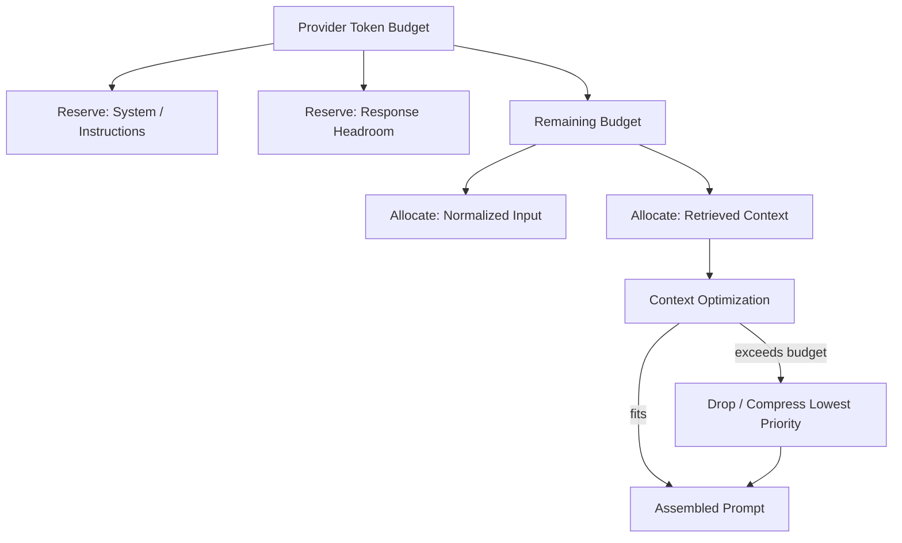

# 020_Context_Pipeline

Status: Draft

Version: 0.1

Owner: PAIOS

---

## Purpose

The Context Pipeline is the sequence of stages that turns a raw user
input into a completed AI response, mediated by memory. It is the
concrete mechanism behind the Constitution's Memory-First principle:
every request is expected to read from, and write back to, persistent
memory rather than being handled as a stateless, one-shot exchange. This
document defines the pipeline's stages, how each is bounded, and how the
pipeline stays within the constraints of any given AI provider (see
[080_AI_Router](080_AI_Router.md)) regardless of which one is active.

---

## Context Lifecycle

A single request moves through the pipeline as one context lifecycle,
from raw input to a persisted, post-processed result. The pipeline runs
on top of the [Core Kernel](010_Core_Kernel.md)'s Event Bus: each stage
completes by emitting an event that the next stage consumes.

Each stage below is a distinct, independently testable unit with its own
interface; no stage reaches past its neighbor to call another stage
directly.

---

## Input Processing

Input Processing is the pipeline's entry boundary: it normalizes
whatever the user or calling application sent into a well-defined
internal representation before anything else touches it.

- Validates and sanitizes raw input (text, attachments, structured
  payloads) against the input schema.
- Normalizes format (encoding, whitespace, structured-field extraction)
  so downstream stages never branch on input source or shape.
- Attaches request-scoped metadata (timestamp, session identifier,
  originating application) needed by later stages and by memory writes.
- Errors at this boundary (malformed input, unsupported payload) are
  rejected here, per the Constitution's rule that errors are handled at
  system boundaries; later stages assume their input is already valid.

---

## Memory Retrieval

Memory Retrieval turns the normalized input into a query against the
memory layer, and returns the subset of stored context relevant to this
request. This is the pipeline's connection point to
[050_Memory_Model](050_Memory_Model.md) and
[060_Knowledge_Graph](060_Knowledge_Graph.md).

- The normalized input is translated into one or more retrieval queries
  (semantic, keyword, graph-relationship, or a combination).
- Retrieval reads only through the memory layer's published interfaces;
  it has no knowledge of the underlying storage backend
  (see [070_Storage_Architecture](070_Storage_Architecture.md)).
- Results are ranked by relevance to the current input, not returned as
  an unranked dump; irrelevant matches are discarded before assembly.
- Retrieval is read-only. It never mutates memory; writes happen only in
  Output Post-Processing.

---

## Prompt Assembly

Prompt Assembly combines the normalized input and retrieved context into
the final prompt sent to whichever AI provider is active. It is the
stage responsible for making the finished prompt provider-agnostic in
shape, delegating provider-specific formatting to the adapter layer in
[080_AI_Router](080_AI_Router.md).

- Merges normalized input, retrieved memory, and any system/instruction
  content into a single ordered prompt structure.
- Applies Context Optimization and Token Management (below) before the
  prompt is considered final.
- Produces a provider-agnostic prompt representation; translating that
  representation into a specific provider's request shape is the AI
  Router's job, not this stage's.
- Assembly is deterministic for a given input and retrieved context: the
  same inputs produce the same assembled prompt, so behavior is
  reproducible and testable.

---

## Output Post-Processing

Output Post-Processing takes the AI provider's raw response and turns it
into both the user-facing result and any durable memory update.

- Validates and normalizes the raw model output (format, structured
  fields) before it is returned to the caller.
- Extracts what should be persisted (new facts, updated preferences,
  summarized exchanges) and writes it back through the memory layer's
  interfaces.
- Emits a completion event on the Event Bus so other modules (e.g.
  logging, workflow, or plugin subscribers) can react without the
  pipeline knowing who, if anyone, is listening.
- Failures here (a malformed provider response, a memory write failure)
  are handled at this boundary; they do not silently produce a
  half-updated memory state.

---

## Context Optimization

Context Optimization decides what retrieved context actually makes it
into the assembled prompt, since retrieval may return more than is
useful or affordable.

- Deduplicates overlapping or redundant retrieved items before assembly.
- Prioritizes retrieved context by relevance ranking and recency, dropping
  lower-priority items first when space is constrained.
- Summarizes or compresses lower-priority context rather than omitting it
  outright, when a compressed form still adds value within budget.
- Optimization decisions are logged as part of the assembled prompt's
  metadata, so a given response's context selection is auditable, not
  opaque.

---

## Token Management

Token Management enforces the hard constraint that the assembled prompt
must fit within the active AI provider's context window, and that the
budget is spent deliberately rather than by truncation as an
afterthought.

- The token budget for a request is derived from the active provider's
  context window, obtained through the AI Router's provider interface,
  not hard-coded per provider in the pipeline.
- Budget is reserved first for required content (system instructions,
  the normalized input, and headroom for the expected response); only
  the remaining budget is available to retrieved context.
- When optimized context still exceeds the remaining budget, Token
  Management drops or further compresses the lowest-priority items
  until the prompt fits — it never silently truncates mid-content.
- Because the budget is computed from the provider interface rather than
  assumed, the same pipeline logic works unchanged across providers with
  different context window sizes.

---

## Future Work

- Define the concrete relevance-ranking algorithm(s) usable by Memory
  Retrieval and how they are selected or combined per request.
- Specify the summarization/compression strategy used by Context
  Optimization when trimming lower-priority context.
- Define the event schemas emitted at each pipeline stage boundary (see
  [040_Event_Model](040_Event_Model.md)).
- Evaluate support for streaming responses through Output
  Post-Processing, rather than only complete-response handling.
- Define caching strategy for repeated or near-duplicate retrieval
  queries within a session.

---
