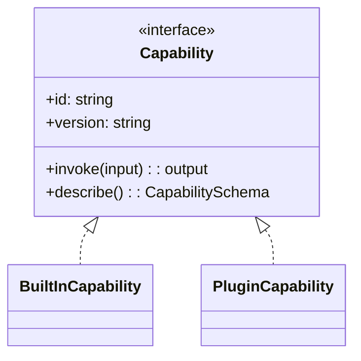
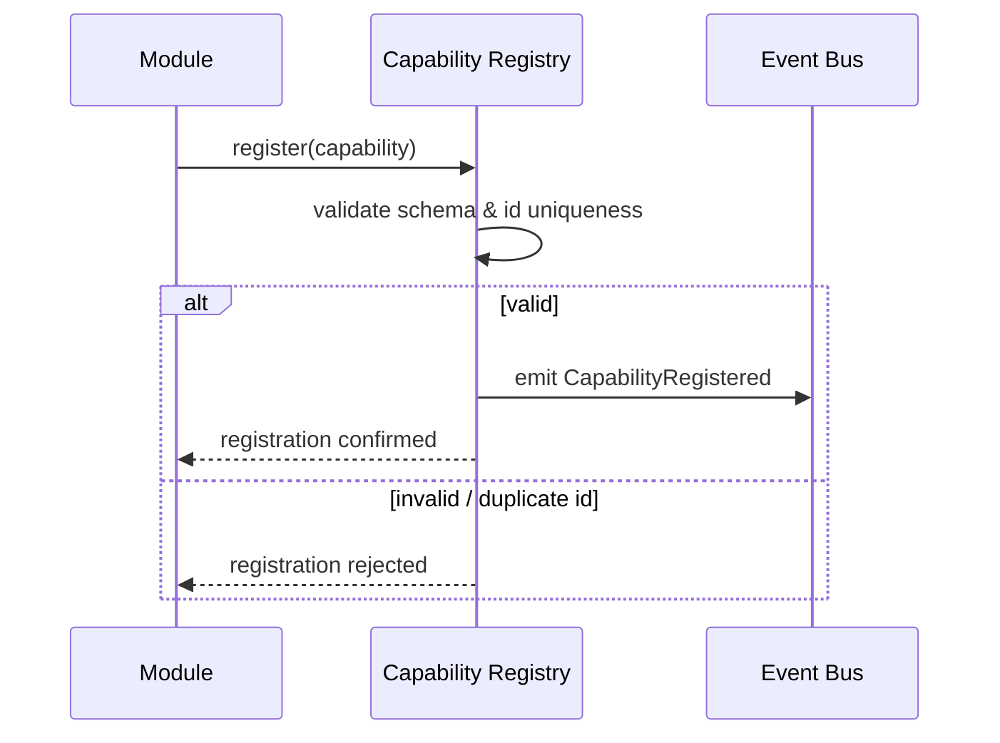
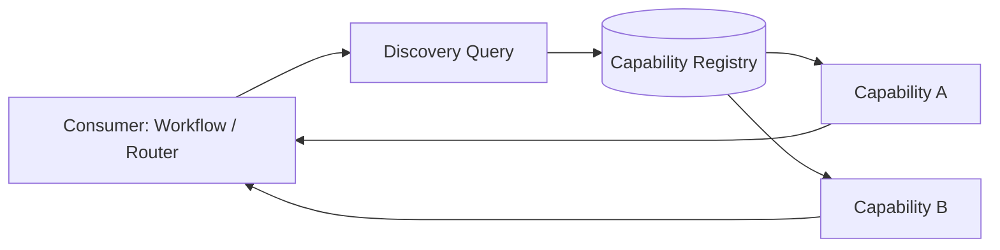
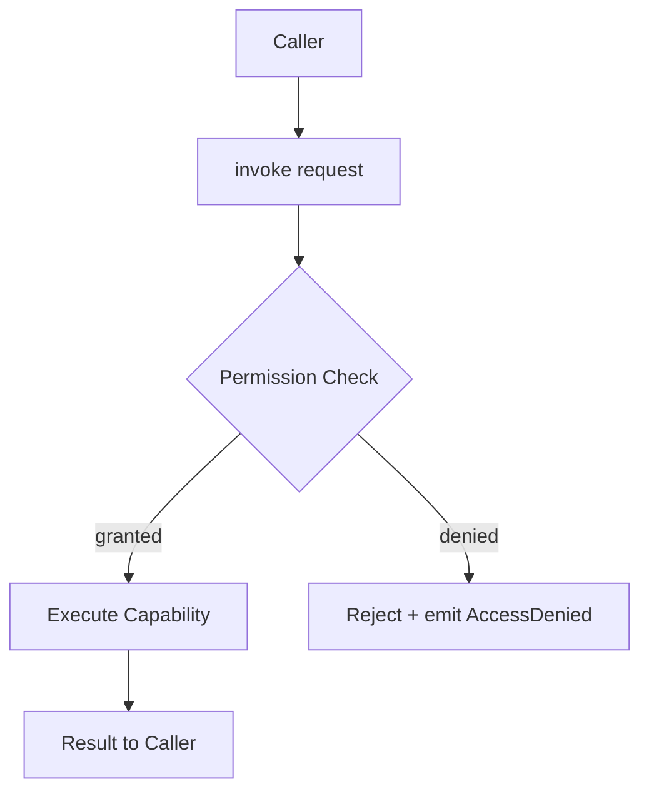

# 030_Capability_Model

Status: Draft

Version: 0.1

Owner: PAIOS

---

## Purpose

The Capability Model defines what a "capability" is in PAIOS, and how the
system exposes, discovers, and governs the units of functionality that
sit above the [Core Kernel](010_Core_Kernel.md). It is the concrete
mechanism behind the Constitution's Plugin-First principle: the kernel
stays minimal because functionality is expressed uniformly as
capabilities, whether built-in or contributed by a plugin.

---

## Capability Abstraction

A capability is a single, named, interface-bound unit of functionality
that the rest of the system (workflows, the AI Router, other
capabilities) can invoke without knowing how it is implemented or where
it came from.

- Every capability implements the same `Capability` interface, regardless
  of whether it ships with the kernel or arrives via a plugin. Consumers
  depend on this interface only, per the Constitution's Interface-First
  principle.
- A capability declares an identity (`id`), a `version`, an `invoke`
  contract (typed input/output), and a machine-readable schema describing
  itself (`describe`).
- Capabilities are stateless with respect to invocation: any state they
  need is read from and written to the memory layer, not held privately
  in a way that couples them to a single running instance.
- Capabilities do not call each other directly; composition happens
  through the Event Bus or through an orchestrating workflow (see
  [110_Workflow_Engine](110_Workflow_Engine.md)), not through hard
  references between capability implementations.

---

## Built-in Capabilities

Built-in capabilities ship with the kernel distribution itself. Per the
Constitution ("if a feature can be a plugin, it must be a plugin"), the
set of built-in capabilities is kept intentionally small — limited to
functionality the system cannot safely operate without.

- Registered the same way as plugin capabilities, through the same
  Registration mechanism below; "built-in" describes packaging and
  trust level, not a different code path.
- Cannot be removed at runtime, but can still be replaced: a plugin may
  register a capability with the same `id` at a higher precedence if the
  system's configuration explicitly allows an override.
- Held to the same interface and versioning discipline as any plugin
  capability — the kernel does not grant its own built-ins a shortcut
  past the abstraction.

---

## Plugin Capabilities

Plugin capabilities are the primary way PAIOS grows. They are supplied by
plugins loaded through the kernel's Module Lifecycle Manager (see
[010_Core_Kernel](010_Core_Kernel.md#module-lifecycle)) and register one
or more capabilities during their `start()` phase.

- A plugin may expose zero, one, or many capabilities; the plugin module
  and the capabilities it registers are related but distinct concepts.
- Plugin capabilities run behind the same Error Boundary as their owning
  module: a fault inside a plugin capability's `invoke` is contained and
  reported, not allowed to propagate into the caller or other
  capabilities.
- A plugin capability's implementation, including any provider or storage
  dependency it uses, is resolved through dependency injection — it
  never reaches past its own interfaces into kernel internals or another
  plugin's internals.

---

## Registration

Registration is how a capability, built-in or plugin, becomes visible to
the rest of the system. It happens once, during a module's `start()`
phase in the boot lifecycle, and is mediated by a single Capability
Registry kernel service.

- A capability registers with its `id`, `version`, and schema; the
  registry validates the schema and checks for `id` conflicts before
  accepting it.
- Registration failures (invalid schema, unresolvable duplicate `id`) are
  rejected at this boundary and reported, consistent with the
  Constitution's rule that errors are handled at boundaries — they do not
  silently disable half of a module's registration.
- Successful registration emits a `CapabilityRegistered` event so other
  interested modules (a discovery index, a permissions auditor) can react
  without the registry knowing who is listening.
- Deregistration mirrors registration: it happens during a module's
  `stop()`/`unload()` phase and emits a corresponding event.

---

## Discovery

Discovery is how consumers (workflows, other capabilities, the AI
Router) find capabilities relevant to a task without hard-coding a
specific capability's `id` wherever possible.

- The Capability Registry supports lookup both by exact `id` and by
  descriptive query (schema shape, declared category/tags) against the
  set of currently registered capabilities.
- Discovery only returns capabilities that are currently `Started` in the
  module lifecycle sense; a capability whose owning module has stopped is
  not discoverable, even if its registration record still exists.
- Discovery results respect the Permission Model below: a consumer only
  sees capabilities it is authorized to invoke.

---

## Permission Model

Every capability invocation is checked against a permission model so
that a plugin capability cannot silently access memory, providers, or
other capabilities beyond what it has been granted.

- Each capability declares the permissions it requires (e.g. read/write
  scopes on memory, network egress, which other capabilities it may
  invoke) as part of its registration schema.
- A capability's declared permissions are granted explicitly at
  install/configuration time; nothing is granted implicitly by virtue of
  being registered.
- Every invocation is checked against the caller's and callee's granted
  permissions before `invoke` runs; a denied check rejects the call and
  emits an event, it does not fail silently or partially execute.
- Built-in capabilities are subject to the same checks as plugin
  capabilities; trust is not assumed from packaging alone.

---

## Versioning

Capabilities are versioned independently of the kernel and of each
other, so that consumers can depend on a stable contract even as
implementations evolve.

- A capability's `version` follows semantic versioning: **MAJOR** for a
  breaking change to its `invoke` input/output contract, **MINOR** for
  backward-compatible additions, **PATCH** for internal fixes with no
  contract change.
- Multiple versions of the same capability `id` may be registered
  simultaneously during a migration window; the registry resolves which
  version a given consumer receives based on the consumer's declared
  compatibility range.
- A breaking (MAJOR) version change requires a new registration cycle,
  not an in-place mutation of the existing registration — consumers are
  never silently handed a contract they did not agree to.
- Deprecation of an old capability version is announced via an emitted
  event before removal, giving consumers a migration window rather than
  an abrupt break.

---

## Future Work

- Define the concrete schema format used for capability `describe()` and
  permission declarations.
- Specify the discovery query language (tags, categories, schema
  matching) in full.
- Define conflict-resolution rules when a plugin attempts to override a
  built-in capability's `id`.
- Evaluate a capability marketplace/catalog for third-party discovery
  outside a single running instance.

---
