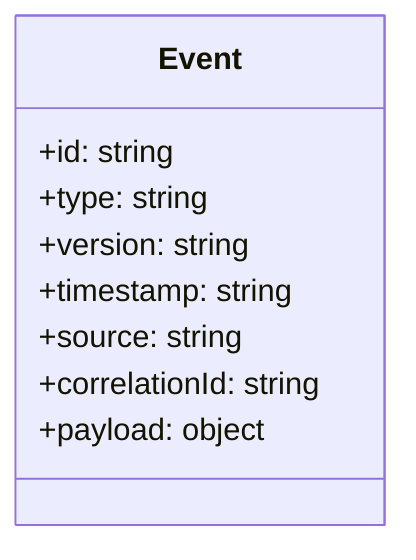
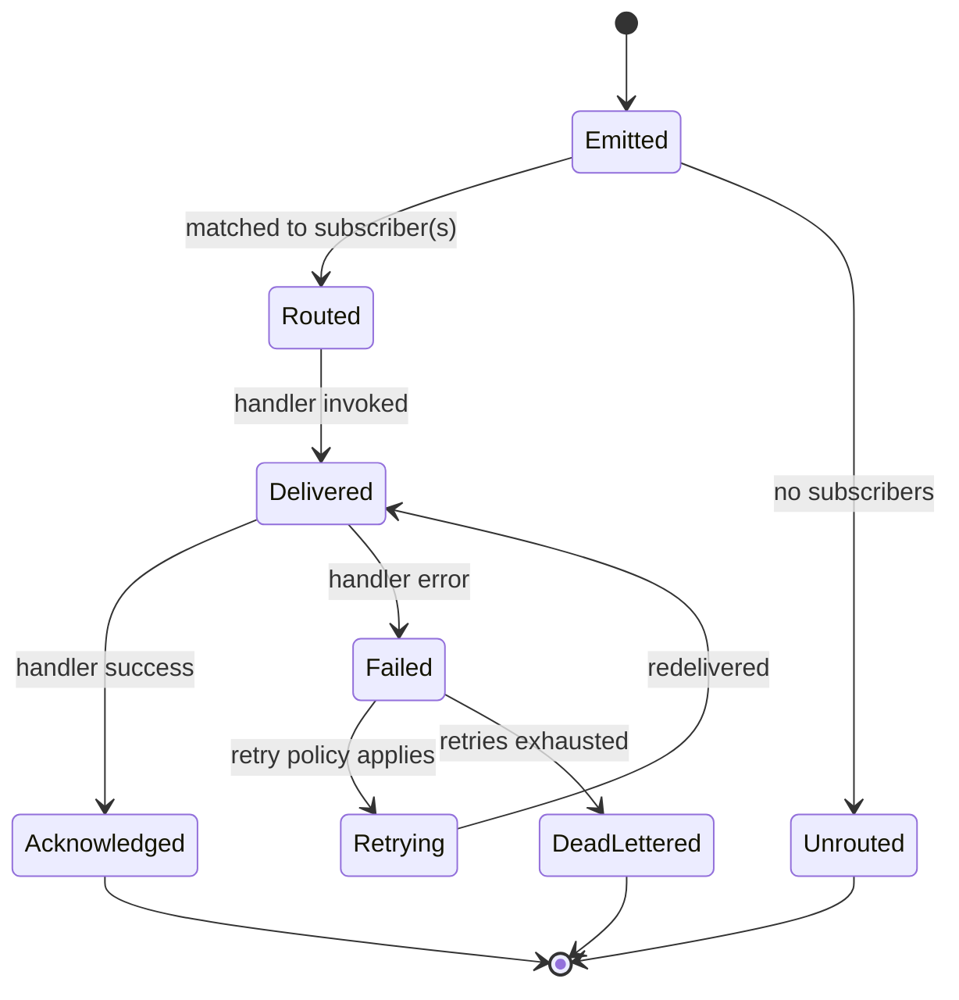
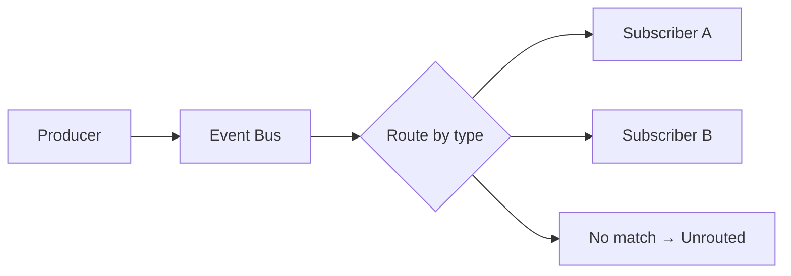
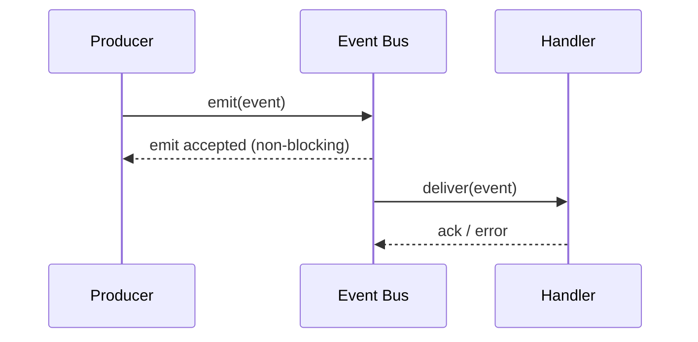
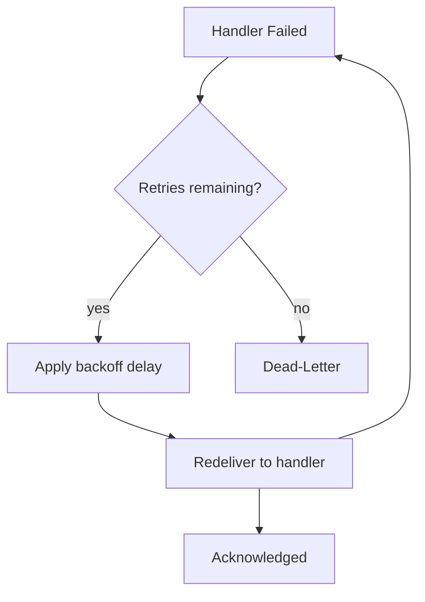

# 040_Event_Model

Status: Draft

Version: 0.1

Owner: PAIOS

---

## Purpose

The Event Model defines the vocabulary and rules for everything that
flows across the [Core Kernel](010_Core_Kernel.md)'s Event Bus. The Event
Bus provides transport only; this document defines what an event
actually looks like, how it moves through its lifecycle, how it is
routed, versioned, executed, retried, and — when it cannot be delivered —
handled as dead-lettered. It is the concrete specification behind the
Constitution's Event-Driven Architecture principle.

---

## Event Schema

Every event has exactly one documented schema and exactly one producer
of truth, per the Constitution's coding standards. No event is emitted
without a corresponding schema.

- **id** — a unique identifier for this specific event instance, used for
  idempotency checks and dead-letter tracking.
- **type** — the event's name (e.g. `ModuleStarted`, `CapabilityRegistered`),
  namespaced by the owning module so two modules cannot collide on the
  same type.
- **version** — the schema version of this event type (see Event
  Versioning below).
- **timestamp** — when the event was emitted, set by the producer.
- **source** — the module or capability that emitted the event; this is
  the single producer of truth for that event type.
- **correlationId** — links an event to the request or workflow that
  caused it, so a chain of related events can be traced end to end.
- **payload** — the type-specific data, validated against the schema
  declared for `type` + `version`.

An event with an unregistered `type`/`version` combination, or a payload
that fails schema validation, is rejected at emission time — it never
reaches a subscriber malformed.

---

## Event Lifecycle

An event moves through a fixed set of states from emission to final
resolution. The lifecycle is the same regardless of which module
produced or consumes the event.

- **Emitted** — the producer has published the event to the bus.
- **Routed** — the bus has matched the event to zero or more
  subscribers.
- **Unrouted** — no subscriber matched; this is a valid terminal state,
  not an error, since publishers never assume a subscriber exists.
- **Delivered** — a matched handler has been invoked with the event.
- **Acknowledged** — the handler completed without error.
- **Failed** — the handler raised an error; this is evaluated against the
  Retry policy below.
- **Retrying** — the event is redelivered per the retry policy.
- **DeadLettered** — retries were exhausted without success; the event
  moves to dead-letter handling.

---

## Event Routing

Routing is how the Event Bus decides which subscribers receive a given
emitted event.

- Routing is matched on `type` (and, where a subscriber declares it, on
  `version` compatibility); subscribers never receive event types they
  did not register interest in.
- Delivery order to multiple subscribers of the same event follows
  publish order of the event itself, but subscribers are not guaranteed
  to observe each other's side effects — each subscriber's handler must
  be independent, per the Constitution's Single Responsibility standard.
- Routing does not inspect payload contents to decide delivery; content-
  based filtering, if a consumer needs it, happens inside that
  consumer's handler, not in the bus.
- A producer never routes directly to a specific subscriber instance;
  coupling a producer to a specific subscriber would violate the
  Event-Driven Architecture principle's intent.

---

## Event Versioning

Event schemas evolve independently of the modules that use them, following
the same semantic versioning discipline used elsewhere in PAIOS.

- **MAJOR** — a breaking change to the payload schema (field removed,
  type changed, meaning changed).
- **MINOR** — a backward-compatible addition (new optional field).
- **PATCH** — documentation or validation clarification with no schema
  change.
- A producer may emit multiple schema versions of the same `type` during
  a migration window; subscribers declare which version(s) they accept,
  and routing only delivers versions a subscriber has declared support
  for.
- A MAJOR version bump requires the old version to remain emittable (or
  explicitly deprecated with notice) until known subscribers have
  migrated — consumers are never silently handed an incompatible
  payload.

---

## Async Execution

Event handling is asynchronous by default: a producer emitting an event
does not block on subscriber execution.

- `emit` returns once the event is accepted onto the bus, not once every
  subscriber has finished handling it; producers that need a result use
  a request/response capability invocation instead of the Event Bus.
- Each subscriber's handler execution is isolated behind its module's
  Error Boundary (see [010_Core_Kernel](010_Core_Kernel.md#error-boundaries));
  a slow or failing handler does not block delivery to other
  subscribers.
- Handlers must be safe to invoke concurrently with themselves, since a
  burst of events of the same type may be delivered without waiting for
  the prior handler invocation to complete.

---

## Retry

A handler failure does not immediately dead-letter an event; it is first
subject to a retry policy, so that transient failures (a momentarily
unavailable provider, a lock contention) do not require manual
intervention.

- Each event type declares a retry policy (maximum attempts, backoff
  strategy) as part of its schema; there is no single global retry count
  applied blindly to every event.
- Retries use exponential backoff by default, so repeated failures do
  not hammer a struggling downstream dependency.
- A handler must be idempotent with respect to its event's `id`:
  redelivery on retry may invoke the same handler with the same event
  more than once, and the handler is responsible for making that safe
  (e.g. checking whether the effect was already applied).
- Retries are exhausted deterministically (attempts counted per event
  `id`, not per bus restart), so an event cannot retry forever by
  accident.

---

## Dead-Letter Handling

An event whose retries are exhausted is moved to a dead-letter state
rather than being silently dropped, consistent with the Constitution's
requirement that errors are handled at boundaries, not swallowed.

- A dead-lettered event retains its full original payload, its `id`, and
  the history of failures (error, timestamp, attempt count) that led to
  dead-lettering.
- Dead-lettering itself emits a `EventDeadLettered` event on the bus, so
  operational tooling (a health-monitoring plugin, an alerting
  capability) can react without the bus hard-coding any specific
  response.
- Dead-lettered events are inspectable and replayable: an operator or an
  administrative capability can resubmit a dead-lettered event for
  redelivery once the underlying cause is fixed.
- The bus does not automatically retry a dead-lettered event on its own;
  redelivery from the dead-letter state is always an explicit action.

---

## Future Work

- Define the concrete storage/backend for the dead-letter queue and its
  retention policy.
- Specify per-event-type default retry policies and how modules override
  them.
- Define ordering guarantees (or lack thereof) across event types with a
  shared `correlationId`.
- Evaluate cross-process/distributed event transport for future
  multi-instance deployments, beyond the current in-process bus.

---
