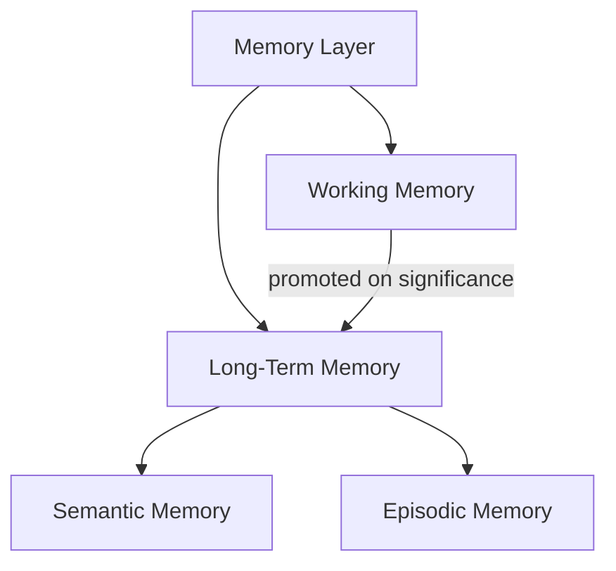
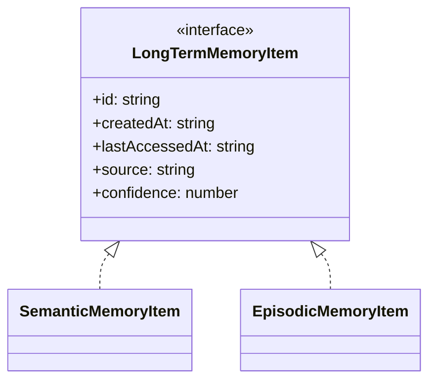
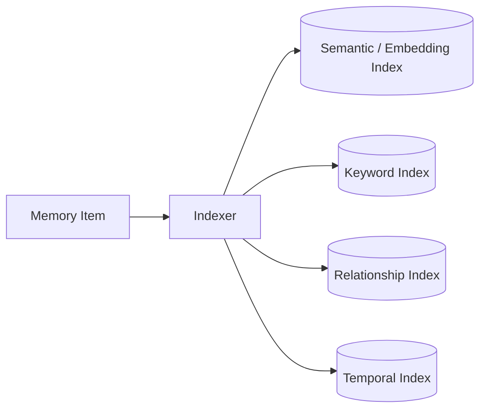
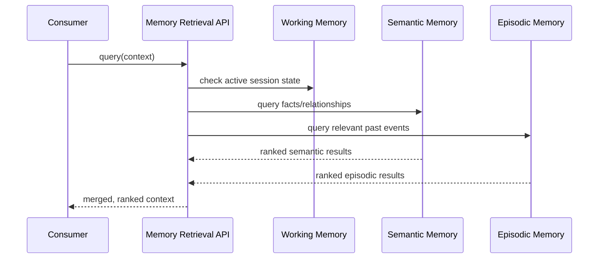
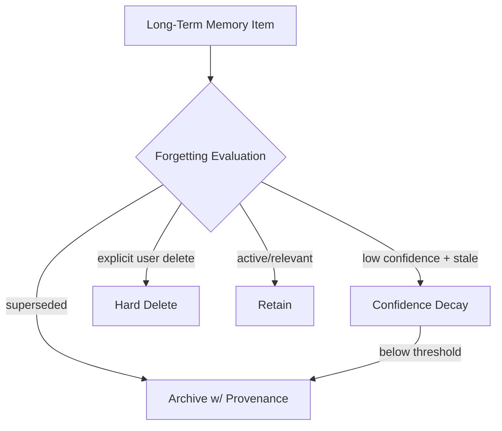

# 050_Memory_Model

Status: Draft

Version: 0.1

Owner: PAIOS

---

## Purpose

The Memory Model defines the categories of memory PAIOS maintains, how
they relate to each other, and how they are indexed, retrieved, and
eventually forgotten. It is the concrete data model behind the
Constitution's Memory-First principle and behind
[020_Context_Pipeline](020_Context_Pipeline.md)'s Memory Retrieval stage.
Storage mechanics (files, databases, embeddings backends) belong to
[070_Storage_Architecture](070_Storage_Architecture.md); this document
defines what is stored and why, not where.

---

## Memory Taxonomy

PAIOS distinguishes four kinds of memory, each with a different lifetime,
structure, and retrieval pattern. All four sit behind the same
memory-layer interfaces, so consumers depend on the abstraction, not on
which kind of memory answered a query.

---

## Working Memory

Working memory holds the active context of a single, in-progress
request or session — the information the [Context
Pipeline](020_Context_Pipeline.md) needs right now, without necessarily
being worth keeping afterward.

- Scoped to a session or an in-flight request; it does not outlive the
  interaction it supports unless explicitly promoted.
- Read and written directly by the Context Pipeline's Input Processing
  and Output Post-Processing stages on nearly every request.
- Bounded in size deliberately (aligned with Token Management's budget in
  [020_Context_Pipeline](020_Context_Pipeline.md#token-management)) —
  working memory is not a place to accumulate unbounded history.
- Content judged significant (a new fact, a stated preference, a
  decision) is promoted into long-term memory at the end of the session;
  everything else is discarded rather than retained by default.

---

## Long-Term Memory

Long-term memory is the durable store of everything PAIOS has learned
about the user across sessions. It is not a single structure but a
category covering two distinct shapes of durable knowledge: semantic and
episodic.

- Every long-term item carries provenance (`source`) and a `confidence`
  score, since not everything remembered is equally certain or equally
  sourced.
- Long-term memory is owned by the user, per the Constitution's
  Human-First stance in [001_Project_Philosophy](001_Project_Philosophy.md):
  it is inspectable, editable, and deletable through the memory layer's
  interfaces, never a hidden internal store.
- Writes to long-term memory happen only through Output Post-Processing
  or an explicit capability invocation — no component writes to it as a
  side effect of an unrelated operation.

---

## Semantic Memory

Semantic memory holds durable facts and relationships that are true
independent of when or how they were learned — the "what PAIOS knows"
layer, closely tied to [060_Knowledge_Graph](060_Knowledge_Graph.md).

- Stores facts, entities, and relationships (e.g. "user's preferred
  editor is X") rather than a record of the conversation that produced
  them.
- Normalized: the same fact is represented once, updated in place when
  it changes, rather than accumulating as a growing list of restatements.
- Queried primarily by relevance to entities/topics in the current
  request, not by recency — a fact from a year ago is as valid as one
  from today unless superseded.
- Superseding a fact updates its record and retains the prior value in
  its history rather than silently overwriting it, so provenance is
  never lost.

---

## Episodic Memory

Episodic memory holds a record of specific past interactions — the "what
happened" layer, as distinct from semantic memory's "what is true."

- Stores discrete events tied to a point in time (a past request, a
  decision made, an outcome observed), each linked to its originating
  session via `correlationId` (see
  [040_Event_Model](040_Event_Model.md#event-schema)).
- Queried primarily by recency and by relevance to the current context,
  since episodic detail matters most when it explains or informs the
  present request.
- Episodic items may be summarized over time (compacting many detailed
  past events into a coarser summary) without deleting the underlying
  record, distinct from Forgetting below which does delete.
- Feeds semantic memory: a pattern observed across multiple episodic
  items (e.g. a repeated preference) can be promoted into a semantic
  fact, but the episodic record that produced it is not deleted merely
  because it was summarized.

---

## Memory Indexing

Indexing is what makes retrieval fast and relevant rather than a linear
scan over everything ever stored.

- Every memory item is indexed along multiple axes at write time:
  semantic similarity (embeddings), keyword, relationship (graph edges),
  and temporal (creation/last-accessed time).
- Indexing is the memory layer's responsibility, not the caller's — a
  capability writing a memory item does not choose or manage indexes
  directly.
- Index maintenance (rebuilding, re-embedding on model change) is an
  internal operation of the memory layer and must not change a memory
  item's `id` or provenance.
- Which physical index technology backs each axis is a storage-layer
  concern (see [070_Storage_Architecture](070_Storage_Architecture.md));
  the indexing contract here is provider-independent.

---

## Retrieval

Retrieval is the read path used by [020_Context_Pipeline](020_Context_Pipeline.md#memory-retrieval)
and any capability that needs prior context.

- A single retrieval query fans out across working, semantic, and
  episodic memory as applicable, and returns one merged, ranked result —
  consumers do not query each memory kind separately.
- Ranking blends relevance (semantic/keyword/graph match) with recency,
  weighted differently per memory kind (episodic favors recency more
  heavily than semantic).
- Retrieval is read-only, consistent with
  [020_Context_Pipeline](020_Context_Pipeline.md#memory-retrieval): it
  never mutates the underlying memory as a side effect of being queried,
  beyond updating `lastAccessedAt` bookkeeping.

---

## Forgetting Strategy

PAIOS forgets deliberately. Unbounded retention is treated as a liability
(cost, staleness, privacy exposure), not a default virtue, so a
forgetting strategy is a required part of the memory model, not an
optional cleanup task.

- **Confidence decay** — items not reaccessed or reconfirmed over time
  have their `confidence` score reduced, lowering their retrieval
  ranking before they are removed outright.
- **Archival** — superseded or fully decayed items are archived (removed
  from active indexes but retained with provenance) rather than
  immediately hard-deleted, preserving auditability.
- **Explicit deletion** — the user can request hard deletion of any
  memory item at any time, per the Human-First principle; a hard delete
  removes the item and its indexes entirely and is not subject to decay
  or archival.
- Working memory is exempt from this strategy since it is already
  bounded and session-scoped by design; forgetting strategy applies to
  long-term (semantic and episodic) memory.

---

## Future Work

- Define concrete confidence-decay functions and their tunable
  parameters.
- Specify the promotion criteria from working memory into long-term
  memory in measurable terms.
- Define the archival retention window before an archived item becomes
  eligible for hard deletion.
- Evaluate per-category (semantic vs. episodic) retrieval ranking
  weights empirically rather than as fixed defaults.

---
