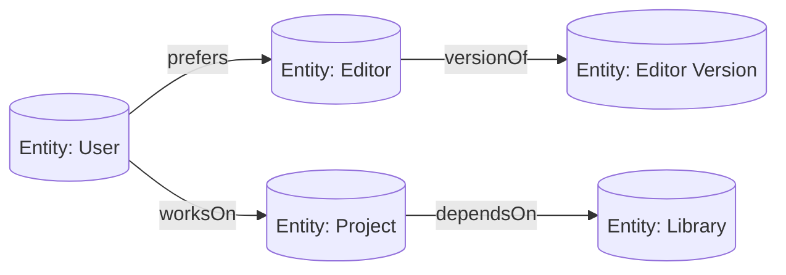
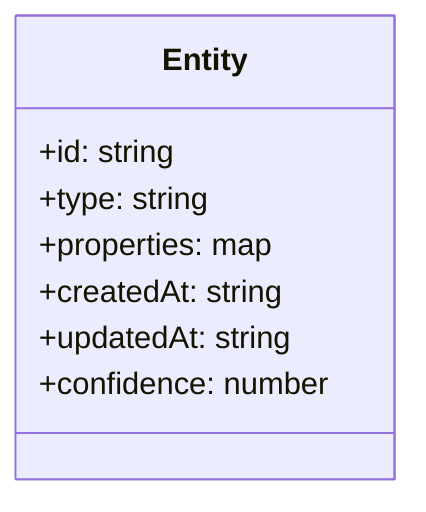
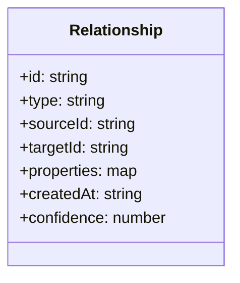
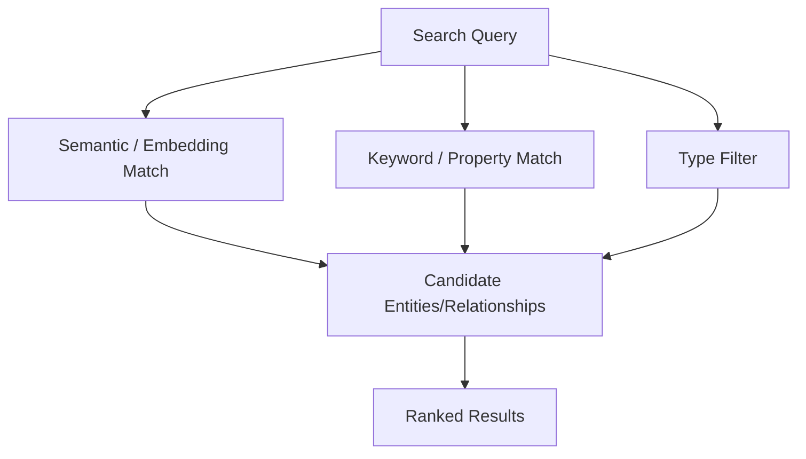
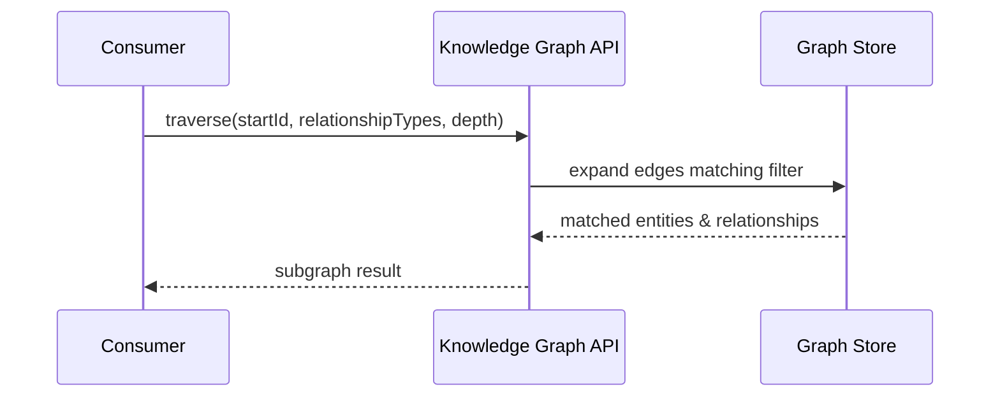
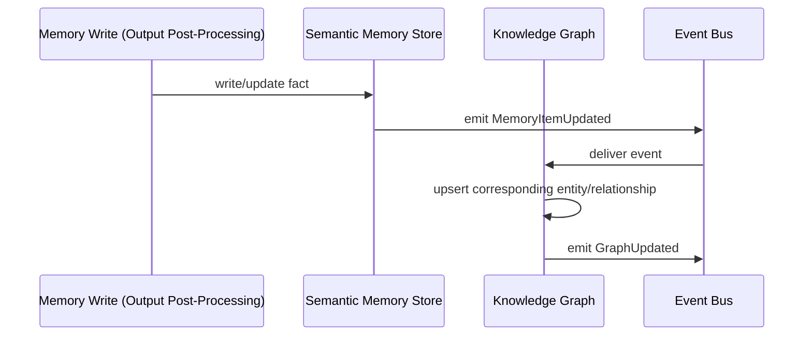

# 060_Knowledge_Graph

Status: Draft

Version: 0.1

Owner: PAIOS

---

## Purpose

The Knowledge Graph is the structured backbone of semantic memory: it
represents entities and the relationships between them, so that
[050_Memory_Model](050_Memory_Model.md#semantic-memory)'s facts are not
just a flat list but a navigable network. This document defines the
graph's data model, how it is searched and traversed, and how it stays
synchronized and consistent with the rest of the memory layer. Physical
storage of the graph is a concern of
[070_Storage_Architecture](070_Storage_Architecture.md); this document
defines the model, not the backend.

---

## Graph Model

The Knowledge Graph is a directed, labeled property graph: nodes are
entities, edges are relationships, and both carry properties.

- Every node is an Entity and every edge is a Relationship; there is no
  third primitive — anything the graph represents is expressed as one or
  the other.
- The graph is directed: a Relationship has a defined source and target,
  even where the underlying real-world connection is conceptually
  symmetric (a symmetric fact is modeled as two directed edges, not one
  undirected one).
- The graph is labeled: both Entities and Relationships carry a `type`
  that determines which properties are valid on them, enforced against a
  schema rather than left freeform.
- The graph is one coherent structure per user, consistent with the
  Constitution's Memory-First and Human-First principles — it is not
  partitioned per plugin or per session; capabilities read and write into
  the same shared graph through the memory layer's interfaces.

---

## Entity

An Entity is a node representing a distinct thing the system knows
about: a person, a project, a preference, a tool, a concept.

- `id` is stable for the entity's lifetime; merging two entities later
  (deduplication) preserves one canonical `id` and records the merge, it
  does not silently reassign references elsewhere in the graph.
- `type` determines the property schema an entity must satisfy (e.g. a
  `Project` entity has different expected properties than a
  `Preference` entity).
- `confidence` mirrors the semantic memory item contract in
  [050_Memory_Model](050_Memory_Model.md#long-term-memory): an entity
  inferred with low certainty is still stored, but ranked and surfaced
  accordingly.
- Entities are created and updated only through the memory layer's
  write interfaces; no capability constructs or mutates a graph node
  directly against storage.

---

## Relationship

A Relationship is a directed, typed edge connecting exactly two
entities, optionally carrying its own properties.

- `type` names the relationship (e.g. `prefers`, `worksOn`,
  `dependsOn`) and constrains which entity types may legally appear as
  `sourceId`/`targetId` for that type.
- A relationship's `confidence` and provenance are tracked independently
  of the confidence of the entities it connects — a low-confidence edge
  between two well-established entities is still marked as uncertain.
- Relationships are never implicit: two entities being related is only
  true in the graph if a Relationship edge exists; nothing is inferred
  at query time that was not written at graph-update time.
- Superseding a relationship (e.g. a changed preference) creates or
  updates the edge and retains prior state in history, mirroring
  semantic memory's supersede-not-overwrite rule.

---

## Search

Search is entry into the graph by content rather than by known
structure — finding entities or relationships that match a query without
already knowing which node to start traversal from.

- Search supports semantic (embedding similarity), keyword/property
  matching, and type filtering, combinable in a single query — the same
  multi-axis approach used by
  [050_Memory_Model](050_Memory_Model.md#memory-indexing)'s indexing.
- Search results are ranked by relevance and confidence, not returned as
  an unranked candidate set, consistent with
  [020_Context_Pipeline](020_Context_Pipeline.md#memory-retrieval)'s
  requirement that retrieval returns ranked, not raw, results.
- Search is the typical entry point before Traversal: a query finds
  starting entities, then traversal expands outward from them.

---

## Traversal

Traversal is structural navigation across the graph, starting from one
or more known entities and following relationships outward.

- Traversal is bounded by an explicit depth and, typically, a
  relationship-type filter; unbounded traversal is not the default,
  consistent with the Constitution's KISS principle and with Token
  Management's need for a bounded, predictable amount of context.
- Traversal results are returned as a subgraph (entities plus the
  relationships connecting them), not flattened into a list, so the
  caller retains the structural information that made traversal useful
  in the first place.
- Traversal never mutates the graph; like Retrieval in the Memory Model,
  it is a read-only operation.

---

## Synchronization

Synchronization keeps the Knowledge Graph consistent with the semantic
memory items it represents, since the graph is a structural view over
data that also has a flatter representation in
[050_Memory_Model](050_Memory_Model.md).

- A semantic memory write is the single source of truth; the graph
  update is derived from it via an emitted event, not written to
  directly and separately by the same caller — this avoids two
  divergent copies of the same fact.
- Synchronization is asynchronous, consistent with
  [040_Event_Model](040_Event_Model.md#async-execution): a semantic
  memory write completes without waiting for the graph to finish
  updating.
- If graph synchronization fails, it follows the standard Event Model
  retry and dead-letter path
  (see [040_Event_Model](040_Event_Model.md#retry)) rather than silently
  leaving the graph stale with no record of the failure.

---

## Consistency

Because graph updates are asynchronous and derived, the model defines
explicit consistency guarantees rather than assuming the graph is always
perfectly in sync.

- The Knowledge Graph is **eventually consistent** with semantic memory:
  a write is guaranteed to be reflected in the graph after
  synchronization completes, not necessarily at the instant the write
  occurs.
- Readers that require read-your-write guarantees (e.g. a workflow that
  writes a fact and immediately needs to traverse from it) query
  semantic memory directly rather than relying on the graph having
  caught up.
- Referential integrity is enforced at write time: a Relationship cannot
  be created referencing a `sourceId`/`targetId` that does not exist as
  an Entity; dangling edges are rejected, not tolerated.
- Conflicting concurrent updates to the same entity are resolved using
  the same provenance-preserving supersede rule as semantic memory —
  the losing update is retained in history, not discarded.

---

## Future Work

- Define the concrete entity and relationship type schemas shipped with
  the initial release.
- Specify entity deduplication/merge detection strategy in detail.
- Define maximum traversal depth defaults and how a capability requests
  an override.
- Evaluate a query language for combined search + traversal in a single
  request, rather than requiring two round trips.

---
