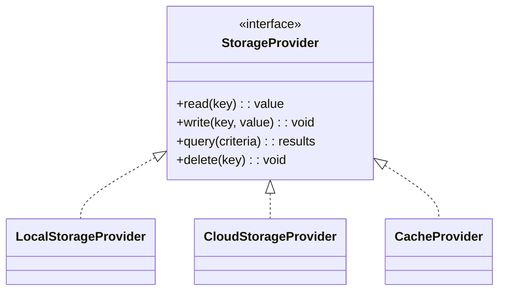
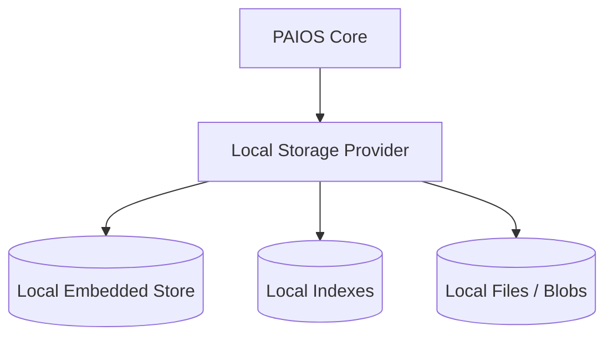
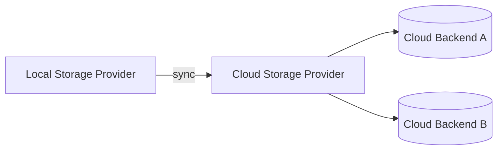
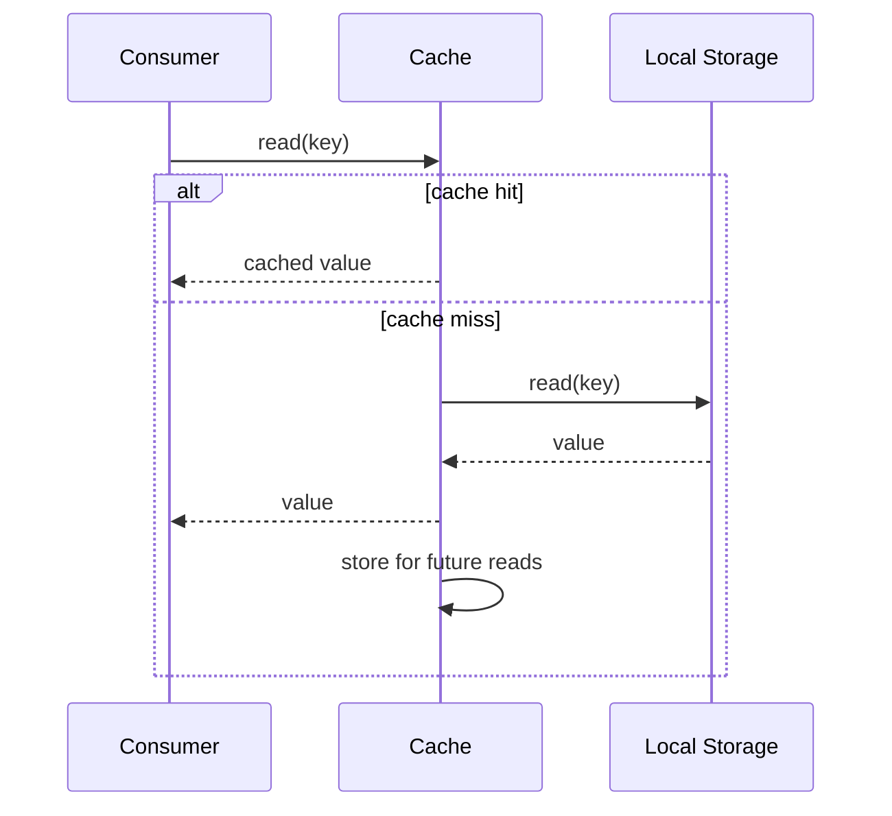
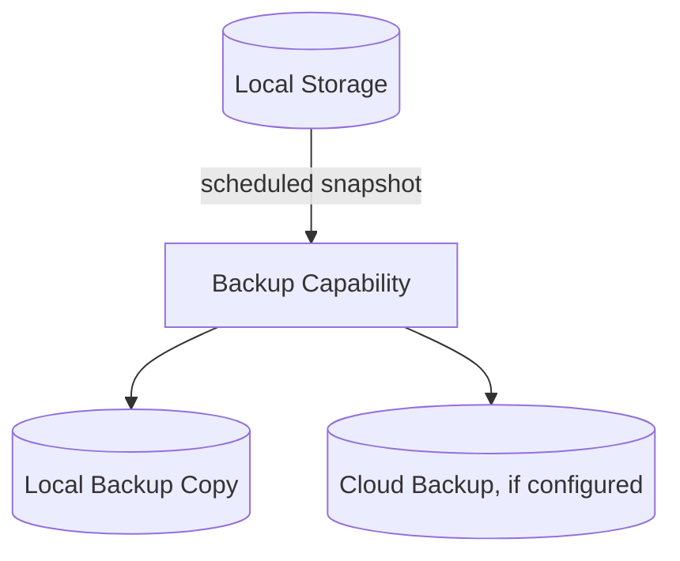
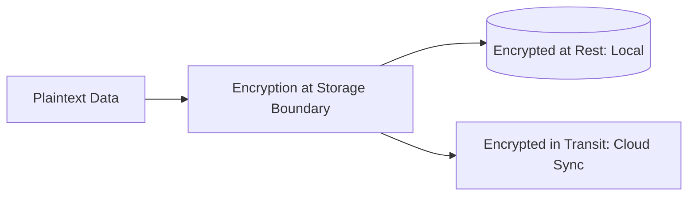
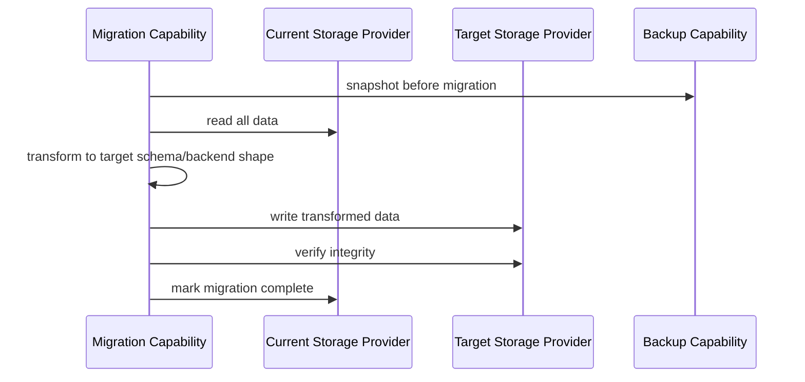

# 070_Storage_Architecture

Status: Draft

Version: 0.1

Owner: PAIOS

---

## Purpose

Storage Architecture defines where and how PAIOS persists data —
working, semantic, and episodic memory (see
[050_Memory_Model](050_Memory_Model.md)), the Knowledge Graph (see
[060_Knowledge_Graph](060_Knowledge_Graph.md)), and configuration. It is
the concrete backend behind the Constitution's Offline-First principle
and the Interface-First principle applied to persistence: every storage
concern is accessed through an abstraction, never through a hard-coded
backend.

---

## Storage Abstraction

No component in PAIOS talks to a concrete storage technology directly.
All reads and writes go through a Storage Provider interface, resolved by
the [Core Kernel](010_Core_Kernel.md)'s DI container, exactly as AI
providers are abstracted in
[080_AI_Router](080_AI_Router.md).

- The Memory Layer, Knowledge Graph, and Configuration Service all depend
  on `StorageProvider` (or a more specific sub-interface built on it),
  never on a concrete database, filesystem, or cloud SDK type.
- Swapping the storage backend (e.g. moving from an embedded local
  database to a different one) means changing what is registered in the
  DI container, not changing any consumer code, per the Constitution's
  Dependency Inversion standard.
- No provider-specific type (a driver's row object, a cloud SDK
  response) crosses the `StorageProvider` boundary; adapters translate to
  and from PAIOS-native types only.

---

## Local Storage

Local storage is the default and required storage tier: per the
Constitution's Offline-First principle, PAIOS must remain usable without
network connectivity, which means core data lives locally first.

- Local storage holds the authoritative copy of working memory,
  long-term memory, the Knowledge Graph, and configuration by default.
- All core read/write paths function with only the Local Storage
  Provider available; no core operation requires Cloud Storage to be
  reachable.
- Local storage is the source of truth when local and cloud copies
  disagree, unless the user has explicitly configured cloud as
  authoritative for a given data category.

---

## Cloud Storage

Cloud storage is an optional, additive tier — used for backup,
cross-device sync, or capacity beyond what local storage practically
holds — never a hard dependency for basic operation.

- Accessed through the same `StorageProvider` interface as local
  storage; a consumer requesting sync or backup does not know or care
  which concrete cloud backend is configured.
- Multiple cloud backends can be supported as interchangeable adapters,
  consistent with the Constitution's Provider Independent principle — no
  PAIOS feature is architecturally coupled to one specific cloud vendor.
- Cloud storage operations are always asynchronous relative to the local
  write that triggers them: a local write completes and is usable
  offline before any cloud sync occurs.
- Loss of cloud connectivity degrades sync/backup availability only; it
  never degrades core local read/write functionality.

---

## Cache

The Cache is a non-authoritative, ephemeral storage tier that sits in
front of local and cloud storage to reduce latency for frequently
accessed data (e.g. embeddings, recent retrieval results).

- The cache never holds data that does not also exist in local (or
  cloud) storage; it is strictly a performance layer, not a source of
  truth.
- Cache entries are invalidated on write to the underlying key, so a
  consumer never observes stale data after performing its own write.
- Cache eviction (size- or time-based) can silently drop entries at any
  time without data loss, since the authoritative copy always lives in
  local or cloud storage.
- Cache is implemented behind the same `StorageProvider`-family interface,
  so callers that want a fast-path read do not need cache-specific code.

---

## Backup

Backup exists to protect against data loss (corruption, device failure,
accidental deletion) independent of the sync functionality Cloud Storage
provides.

- Backups are snapshots of local storage taken on a schedule and before
  risky operations (e.g. a Migration, below), not only on cloud sync
  cadence.
- A local backup copy exists independent of cloud configuration, so
  Offline-First users still have restore capability without any network
  dependency.
- Backup and restore are exposed as capabilities (see
  [030_Capability_Model](030_Capability_Model.md)) subject to the same
  permission model as any other capability — restoring data is a
  privileged operation, not an unguarded one.
- A failed backup is reported, not silently skipped, consistent with the
  Constitution's rule that errors are handled at boundaries.

---

## Encryption

Because long-term memory and the Knowledge Graph hold personal data
owned by the user, encryption is a required property of the storage
layer, not an optional hardening step.

- Data is encrypted at rest in local storage using keys derived from
  user-controlled credentials; PAIOS does not hold a plaintext copy
  independent of an authenticated session.
- Data in transit to any Cloud Storage backend is encrypted end-to-end
  between the local Storage Provider and the cloud adapter; no
  intermediate hop sees plaintext.
- Encryption is implemented once, at the `StorageProvider` boundary, so
  no individual capability or plugin is responsible for encrypting its
  own writes — consistent with DRY and with keeping capabilities free of
  storage internals.
- Key management (rotation, loss-of-key recovery) is a user-facing,
  explicit operation; PAIOS does not silently re-encrypt or discard data
  a user cannot decrypt.

---

## Migration

Migration covers both schema evolution (a stored data shape changing
version) and backend transitions (moving from one storage
implementation to another).

- A migration always takes a Backup first; no migration proceeds against
  unbacked-up data.
- Schema migrations are versioned the same way as everything else in
  PAIOS (semantic versioning); a migration script is tied to a specific
  from-version/to-version pair, not a fuzzy "latest."
- Backend migrations (e.g. changing the concrete local database) are
  possible without touching consumer code, because consumers only ever
  depended on the `StorageProvider` interface, never the backend
  directly.
- Migration verifies data integrity post-write before considering the
  migration complete; a failed verification halts and reports rather
  than leaving storage in a partially migrated, undefined state.

---

## Future Work

- Define the concrete local embedded storage technology and its
  operational limits.
- Specify supported cloud backend adapters and their capability/feature
  parity requirements.
- Define cache sizing and eviction policy defaults per data category.
- Define the key management and recovery UX for encryption at rest.
- Specify the migration script format and how in-progress migrations
  resume after an interruption.

---
