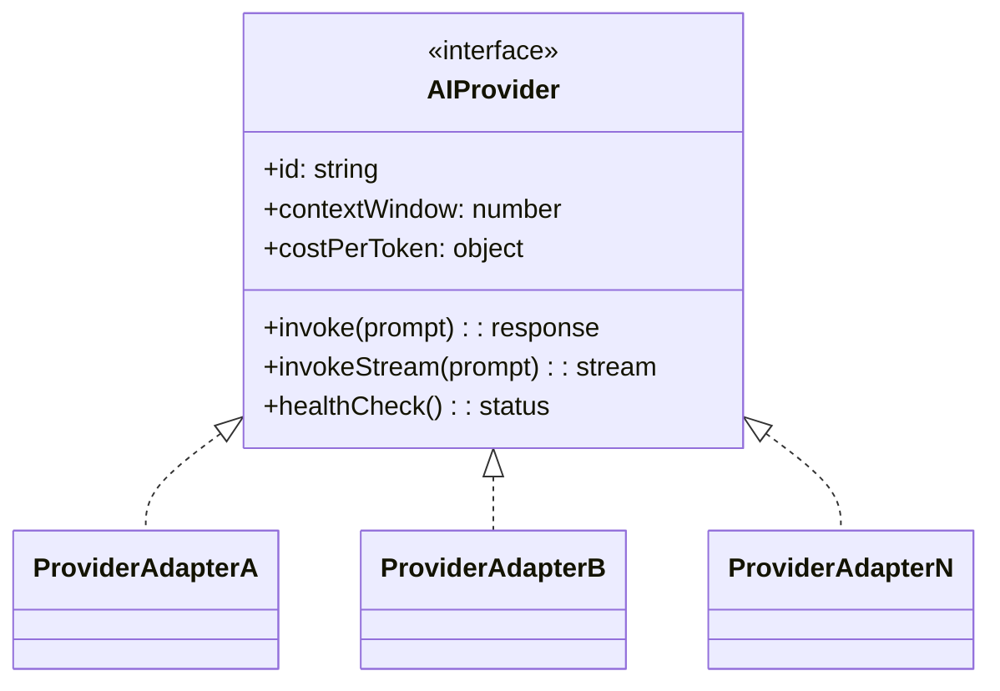
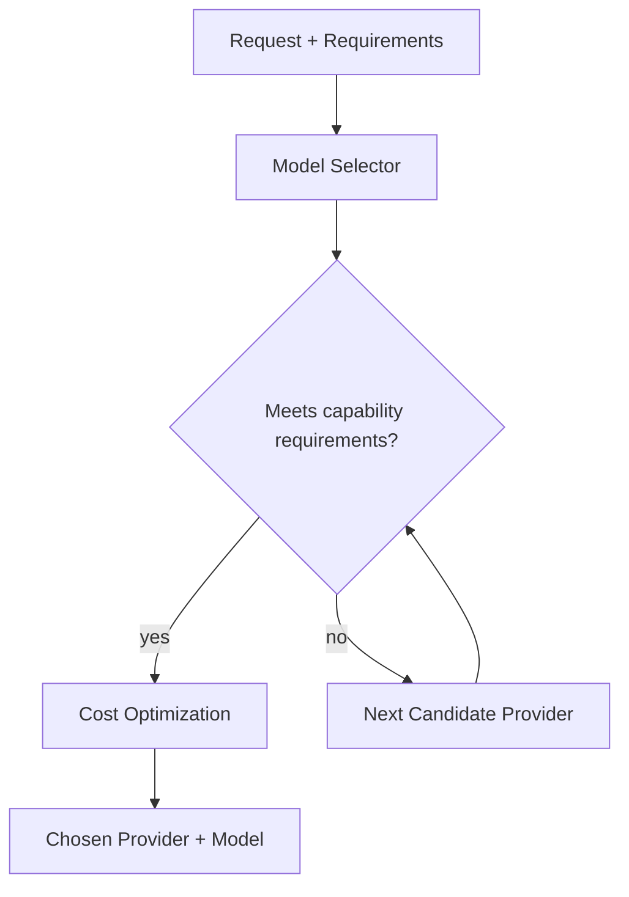
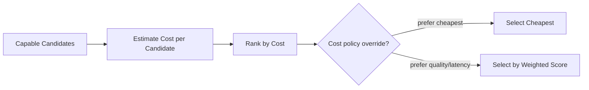
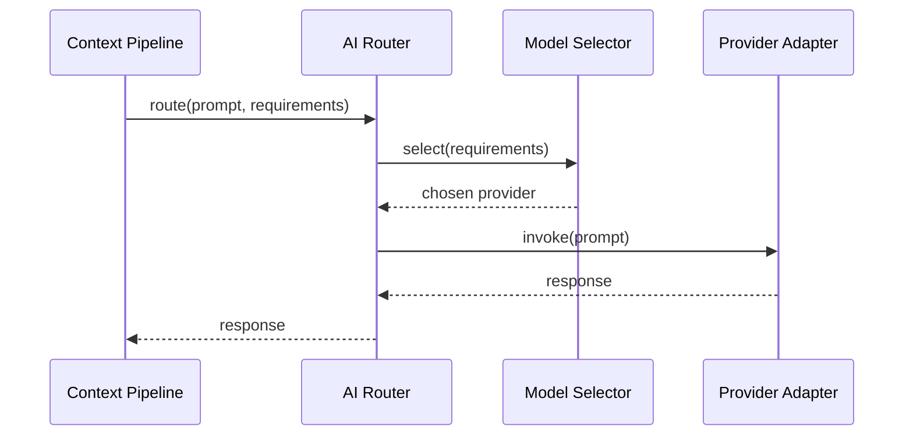
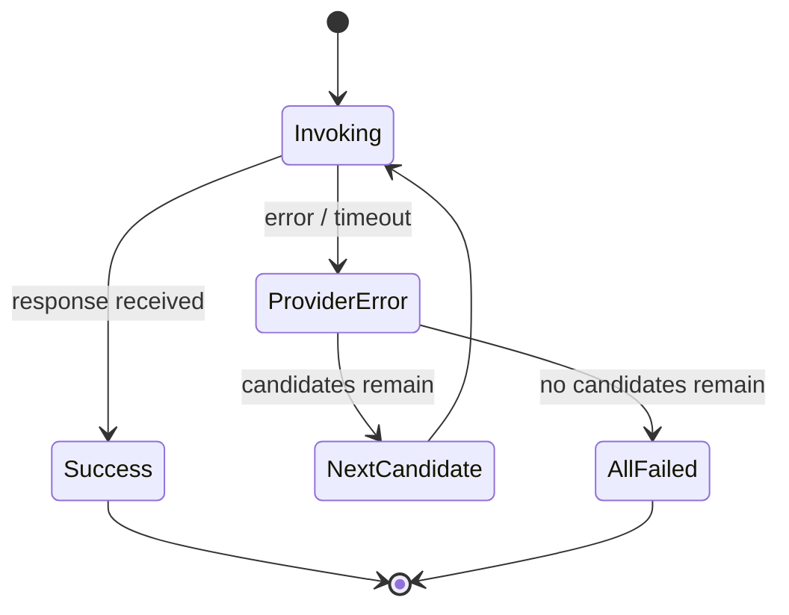
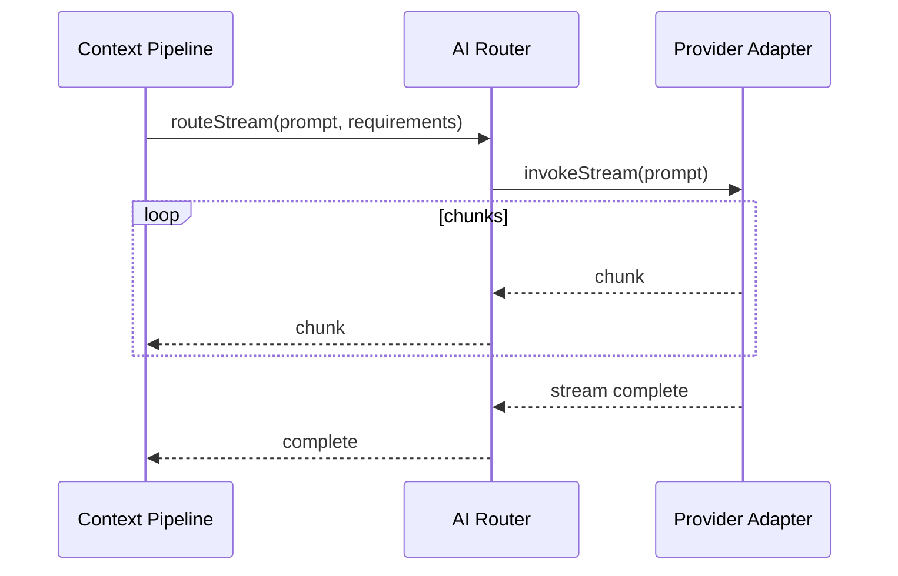
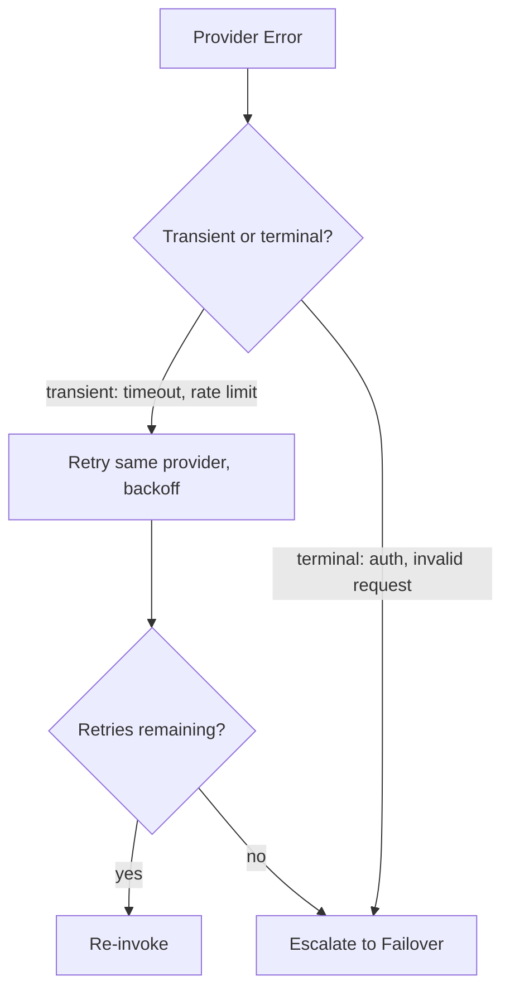

# 080_AI_Router

Status: Draft

Version: 0.1

Owner: PAIOS

---

## Purpose

The AI Router is the sole path through which PAIOS invokes an AI
provider. It is the concrete enforcement point for the Constitution's
Provider Independent principle: no other component knows which model or
vendor is serving a request. This document defines the provider
abstraction, how a model is selected for a given request, and how the
router handles cost, failover, streaming, and retries — all without any
provider-specific type or behavior leaking past it.

---

## Provider Abstraction

Every AI provider is accessed through the same `AIProvider` interface.
The assembled, provider-agnostic prompt produced by
[020_Context_Pipeline](020_Context_Pipeline.md#prompt-assembly) is the
only input the router accepts; translating it into a specific provider's
request shape is the adapter's job, not the caller's.

- Consumers (the Context Pipeline, capabilities) depend on `AIProvider`
  only; they never import or reference a vendor SDK type directly, per
  the Constitution's rule that no provider-specific type may cross an
  adapter boundary.
- `contextWindow` and `costPerToken` are exposed through the interface
  itself, which is how [020_Context_Pipeline](020_Context_Pipeline.md#token-management)'s
  Token Management computes a budget without knowing which provider is
  active.
- Adding a new provider means writing a new adapter against `AIProvider`
  and registering it with the DI container (see
  [010_Core_Kernel](010_Core_Kernel.md#dependency-injection)) — no
  change to the router's own logic or to any consumer.

---

## Model Selection

Model Selection decides which registered `AIProvider` (and which model
offered by it) handles a given request, based on the request's declared
requirements rather than a hard-coded default.

- A request declares its requirements (minimum context window, required
  capabilities such as vision or tool-use, latency sensitivity); the
  selector filters registered providers to those that satisfy them.
- Selection is deterministic for identical requirements and identical
  registered-provider state, so routing behavior is testable and not a
  black box.
- A request may pin a specific provider/model explicitly, bypassing
  selection, for cases where the caller has a hard requirement — but this
  is the exception path, not the default.

---

## Cost Optimization

Among providers that satisfy a request's requirements, the router
prefers the option that minimizes cost, since Model Selection narrows
candidates by capability before cost is even considered.

- Cost is estimated from the assembled prompt's token count and each
  candidate's `costPerToken`, computed before invocation, not
  discovered only after the fact.
- A configurable policy determines whether cost is the sole ranking
  factor or one weighted input alongside quality/latency preferences;
  the default is cost-aware but not cost-only, since correctness and
  capability fit are filtered first.
- Cost optimization never overrides Model Selection's capability filter:
  a cheaper provider that cannot satisfy the request's requirements is
  not eligible, regardless of price.

---

## Routing

Routing is the act of dispatching the assembled prompt to the chosen
provider adapter and returning its response through the same
`AIProvider` interface, regardless of which adapter actually handled it.

- The router is the single choke point between the Context Pipeline and
  any provider; the pipeline never calls a provider adapter directly.
- Routing decisions (which provider was chosen and why) are attached as
  metadata to the response, so the choice is auditable without exposing
  provider internals to the caller.
- Routing is stateless per request: no session affinity to a specific
  provider is assumed unless a request explicitly pins one.

---

## Failover

Failover handles a selected provider being unavailable or erroring, so a
single provider outage does not become a system-wide outage.

- On a provider error or timeout, the router retries the same request
  against the next-ranked candidate from Model Selection's ordered list,
  not just against the same provider.
- Failover is bounded by the same candidate list Cost Optimization
  ranked; it does not fall back to an unregistered or non-capable
  provider under any circumstance.
- If every candidate fails, the router reports a terminal failure to the
  caller rather than silently returning a degraded or partial response.
- A provider's `healthCheck()` result can proactively exclude it from
  candidate selection before a request is even attempted, reducing
  reliance on failing at invocation time.

---

## Streaming

Streaming allows the caller to receive a response incrementally through
`invokeStream`, used when the caller (e.g. an interactive session) wants
partial output as it is generated rather than waiting for completion.

- Streaming is exposed as a distinct interface method (`invokeStream`)
  rather than a flag on `invoke`, keeping the two contracts (buffered vs.
  incremental) explicit and separately testable.
- Every adapter is expected to implement `invokeStream`; where a
  provider's underlying API has no native streaming, the adapter
  simulates chunked delivery so the router's interface contract stays
  uniform across providers.
- Failover during an in-progress stream is not attempted mid-stream: a
  stream that fails partway is reported as a failed stream to the
  caller, which decides whether to retry the request from the start
  against a fallback provider.

---

## Retry Policy

Retry Policy governs how the router responds to a transient provider
error before treating it as a failure eligible for Failover.

- Errors are classified as transient (timeout, rate limit, temporary
  server error) or terminal (authentication failure, malformed request)
  before any retry is attempted; terminal errors escalate directly to
  Failover instead of being retried against the same provider.
- Transient errors are retried against the same provider first, using
  exponential backoff, up to a bounded number of attempts per provider
  before escalating to Failover — consistent with the retry approach in
  [040_Event_Model](040_Event_Model.md#retry).
- Retry attempts and their outcomes are recorded in the response
  metadata alongside the routing decision, so repeated failures are
  diagnosable rather than opaque.
- The retry budget is bounded per request; a request cannot retry
  indefinitely across providers, avoiding unbounded latency for the
  caller.

---

## Future Work

- Define the concrete requirements schema a request declares for Model
  Selection (capability flags, latency tolerance, context window
  minimum).
- Specify default cost-vs-quality weighting and how a user or plugin
  overrides it.
- Define the health-check cadence and thresholds used to proactively
  exclude a provider from candidate selection.
- Evaluate mid-stream failover strategies (resuming from a checkpoint)
  as an enhancement over the current restart-from-scratch approach.

---
