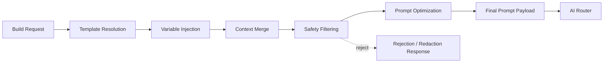
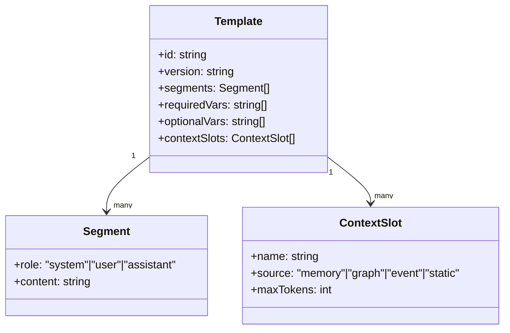
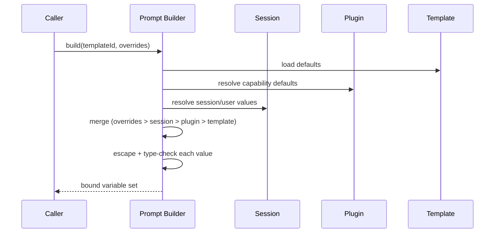
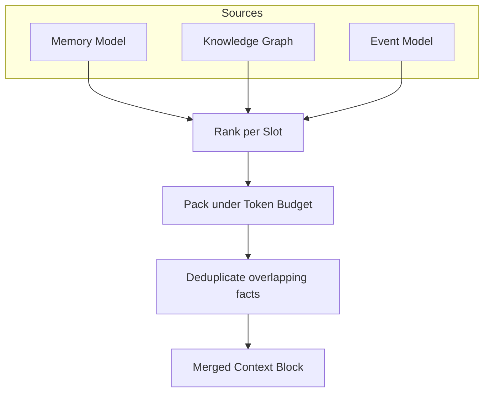
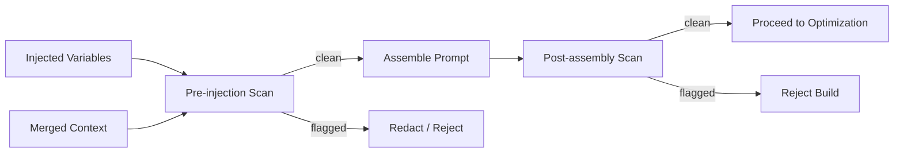
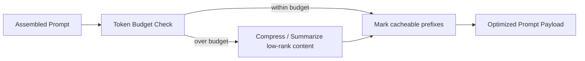

# 090_Prompt_Builder

Status: Draft

Version: 0.1

Owner: PAIOS

---

## Goal

The Prompt Builder assembles the final prompt sent to a model provider from
heterogeneous inputs — templates, runtime variables, retrieved context, and
safety constraints — in a deterministic, auditable way. It sits between the
Context Pipeline (`020_Context_Pipeline.md`) and the AI Router
(`080_AI_Router.md`): the pipeline gathers raw context, the Prompt Builder
turns that context plus a template into a concrete prompt, and the router
picks the model/provider that receives it.

---

## Scope

In scope:

- Prompt pipeline stages, from template selection to final payload.
- Template system: format, versioning, and resolution.
- Variable injection: sourcing, precedence, and escaping.
- Context merge: combining memory, knowledge graph, and event data into a
  bounded context window.
- Safety: input/output filtering and policy enforcement around the prompt.
- Prompt optimization: token budgeting, compression, and caching.

Out of scope:

- Model selection and routing logic (`080_AI_Router.md`).
- Long-term memory storage and retrieval mechanics (`050_Memory_Model.md`).
- Plugin-defined capabilities that merely *consume* built prompts
  (`030_Capability_Model.md`, `100_Plugin_SDK.md`).

---

## Design

### Prompt pipeline

The Prompt Builder runs as a linear pipeline with well-defined, independently
testable stages. Each stage receives the output of the previous stage plus
the original build request, and may short-circuit the pipeline (e.g. a
safety rejection).

- **Template Resolution** — locate and load the template referenced by the
  build request (by ID + version).
- **Variable Injection** — bind named placeholders in the template to
  concrete values.
- **Context Merge** — fold in retrieved memory, knowledge graph facts, and
  recent events, subject to a token budget.
- **Safety Filtering** — validate the assembled content against policy
  before and after optimization.
- **Prompt Optimization** — compress, deduplicate, and reorder content to
  fit the target model's context window and cost profile.

Every stage emits a trace record (stage name, duration, input/output hash)
so a build can be replayed or audited later.

### Template system

Templates are versioned, declarative documents stored alongside plugin or
core assets. A template declares its required and optional variables, the
context slots it wants filled, and the target output structure (system /
user / assistant segments).

Resolution rules:

1. Templates are addressed by `id@version`; unqualified IDs resolve to the
   latest version marked `stable`.
2. Templates may `extend` a parent template, overriding or appending
   segments — resolution walks the extension chain before injection.
3. Missing `requiredVars` at resolution time is a hard build failure, not a
   silently-empty placeholder.

### Variable injection

Variables are bound from multiple sources with a fixed precedence order,
highest first:

1. Explicit caller-supplied overrides (per build request).
2. Session/user state (from the Core Kernel).
3. Capability-provided defaults (from the invoking plugin).
4. Template-declared defaults.

Every injected value is escaped for the target template's delimiter syntax
and type-checked against the variable's declared type (string, number,
list, or structured JSON). Unescaped raw injection into a prompt segment is
disallowed — this is the primary defense against prompt-injection via
user-controlled data (see Safety below).

### Context merge

Context arrives from three independent sources — short/long-term memory,
the knowledge graph, and recent events — each filling one or more
`ContextSlot`s declared by the template. The merge stage ranks candidate
context items per slot, then packs them under the slot's token budget.

Ranking uses recency, relevance score (from retrieval), and an explicit
priority hint from the template. When total ranked content exceeds a slot's
`maxTokens`, lowest-ranked items are dropped first; the pipeline records
what was dropped in the trace so downstream consumers can detect
truncation.

### Safety

Safety runs at two points in the pipeline:

1. **Pre-injection** — variables and retrieved context are scanned for
   injected instructions, secrets, or policy-violating content before they
   ever reach a prompt segment.
2. **Post-assembly** — the fully assembled prompt is scanned as a whole,
   since combinations of individually-safe fragments can still form an
   unsafe instruction.

Policy checks include: instruction-injection patterns in untrusted context,
disallowed content categories, credential/secret patterns, and
template-declared trust boundaries (e.g. a `ContextSlot` sourced from an
external plugin is never permitted to occupy a `system` segment). A
rejected build returns a structured error rather than a partially-built
prompt; a redaction replaces the offending span and continues, with the
redaction logged in the build trace.

### Prompt optimization

Once the prompt is safe and complete, the optimization stage fits it to the
target model's constraints and cost profile:

- **Token budgeting** — enforce the overall context window limit, giving
  fixed priority to system segments, then required template content, then
  merged context by rank.
- **Deduplication** — collapse repeated facts or boilerplate across
  segments and context slots.
- **Compression** — summarize or truncate low-priority context that would
  otherwise be dropped outright, preserving the highest-signal fragment.
- **Caching** — stable prefix segments (system instructions, static
  template content) are hashed and marked cacheable so the AI Router can
  apply provider-side prompt caching.

Optimization never mutates required template segments or safety-approved
content in a way that changes its meaning — only redundant or low-rank
material is eligible for compression.

---

## Interfaces

- `PromptBuilder.build(templateRef, variables, contextRequest) -> PromptPayload`
  — runs the full pipeline and returns the final payload plus build trace.
- `PromptBuilder.preview(templateRef, variables, contextRequest) -> PromptPayload`
  — runs the pipeline without invoking the AI Router; used for debugging
  and template authoring.
- `TemplateRegistry.resolve(id, version?) -> Template` — resolves a
  template reference, following `extend` chains.
- `PromptPayload` — `{ segments, tokenCount, cacheableSpans, trace }`,
  consumed directly by `080_AI_Router.md`.

---

## Future Work

- Per-tenant safety policy overrides.
- Adaptive token budgets based on live provider context-window limits.
- A/B testing framework for template variants with build-trace-based
  evaluation.

</content>
