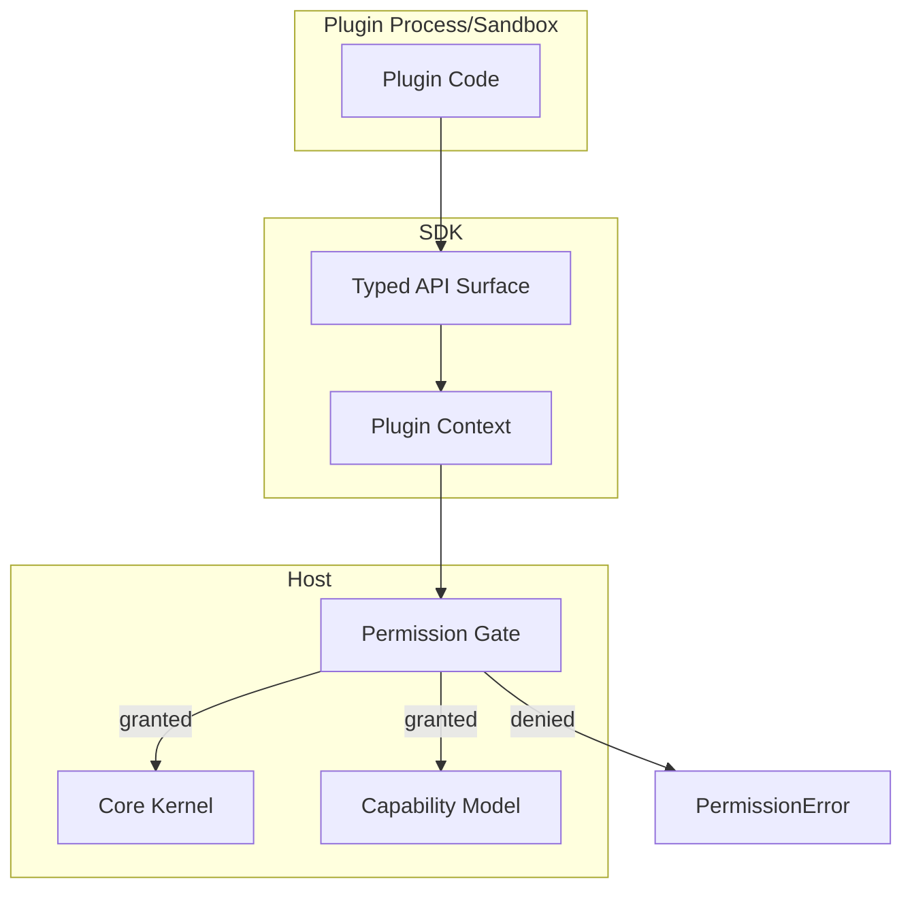
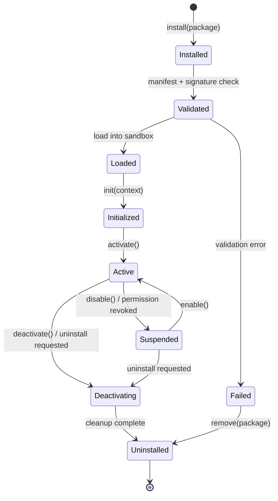
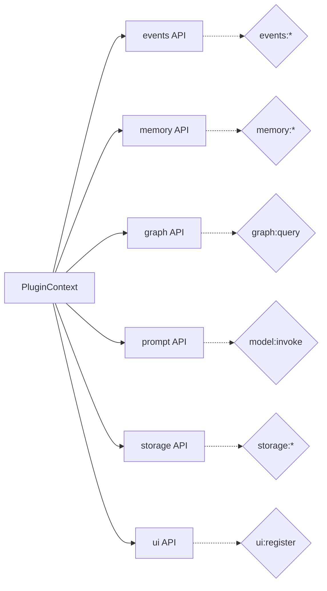
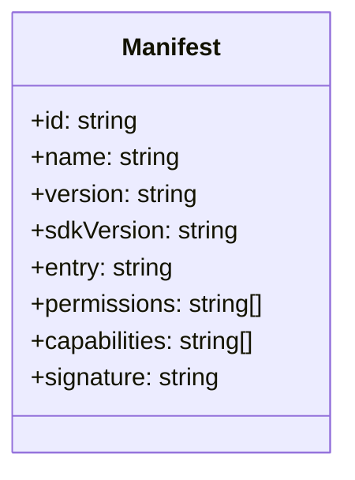
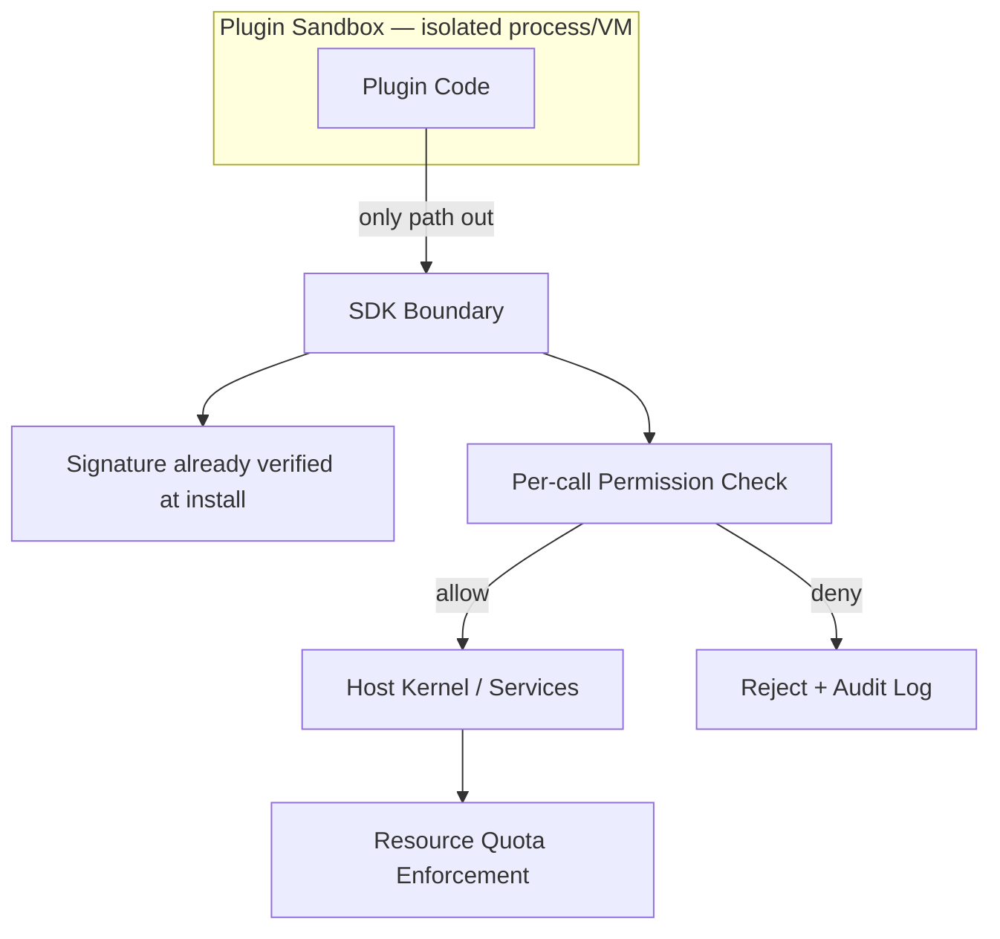
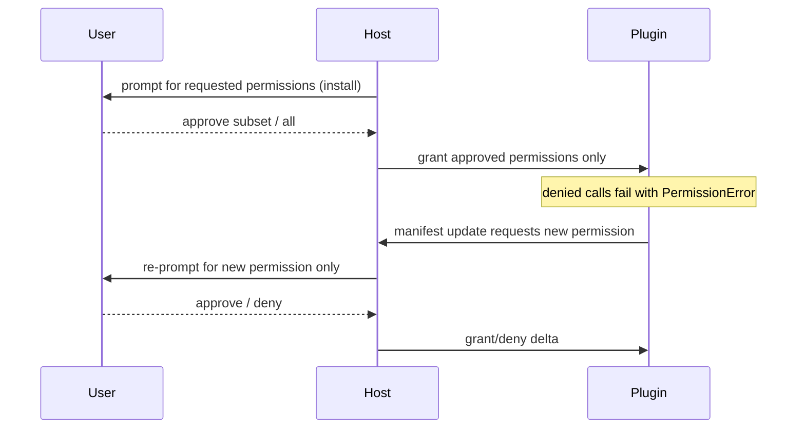
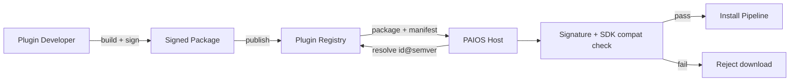

# 100_Plugin_SDK

Status: Draft

Version: 0.1

Owner: PAIOS

---

## Goal

The Plugin SDK is the contract third-party and first-party developers use
to extend PAIOS: it defines how a plugin is packaged, loaded, granted
capabilities, and torn down, without giving it unchecked access to the
kernel, other plugins' data, or the host system. It is the boundary layer
between the Core Kernel (`010_Core_Kernel.md`) / Capability Model
(`030_Capability_Model.md`) and code that PAIOS did not write.

---

## Scope

In scope:

- The SDK surface (APIs) a plugin is given at runtime.
- Plugin lifecycle, from install to uninstall.
- The manifest format used to declare identity, capabilities, and
  permissions.
- Security boundaries and the permission model enforced around plugin code.
- Distribution: how plugins are packaged, signed, and installed.

Out of scope:

- The internals of the Capability Model's grant/revoke engine
  (`030_Capability_Model.md`).
- Prompt construction for plugin-invoked model calls
  (`090_Prompt_Builder.md`).
- Workflow orchestration across multiple plugins (`110_Workflow_Engine.md`).

---

## Design

### SDK

The SDK is a versioned library exposed to plugin code as the only path to
host functionality — plugins never receive raw kernel handles, filesystem
access, or network sockets directly. Every host interaction is mediated
through a typed API surface, and every call is attributed to the calling
plugin for auditing and permission checks.



The SDK is distributed as a language-native package (matching the host
runtime's plugin language) pinned to a `major.minor` compatibility range
declared in the manifest; breaking SDK changes bump the major version and
old plugins continue running against the last compatible SDK build until
they opt in.

### Plugin lifecycle

A plugin moves through a fixed set of states. Transitions are driven by the
host (install/enable/disable/uninstall) or by the plugin itself
(reporting readiness or failure).



- **Installed → Validated** — manifest schema, signature, and declared
  permission set are checked before any plugin code executes.
- **Loaded → Initialized** — the plugin receives a `PluginContext` (its
  scoped SDK handle) and runs one-time setup; it must not assume any
  capability is granted until `Initialized` completes successfully.
- **Active → Suspended** — the host can suspend a plugin at any time (a
  permission is revoked, a resource quota is exceeded) without uninstalling
  it; the plugin must tolerate being suspended and resumed repeatedly.
- **Deactivating → Uninstalled** — the plugin gets a bounded window to
  flush state via its teardown hook before the sandbox is torn down.

### APIs

The SDK exposes API surfaces grouped by concern. Each group is only
reachable if the plugin's manifest declares the matching permission.

| Surface | Purpose | Requires permission |
|---|---|---|
| `events` | Subscribe to / emit kernel events | `events:subscribe`, `events:emit` |
| `memory` | Read/write scoped memory records | `memory:read`, `memory:write` |
| `graph` | Query the knowledge graph | `graph:query` |
| `prompt` | Request a built prompt / model call | `model:invoke` |
| `storage` | Plugin-private key/value storage | `storage:read`, `storage:write` |
| `ui` | Register UI surfaces/commands | `ui:register` |



All API calls are asynchronous and return typed results or a typed error
(`PermissionError`, `QuotaExceededError`, `NotFoundError`, etc.); the SDK
never throws raw host exceptions across the sandbox boundary.

### Manifest

Every plugin ships a manifest describing its identity, requested
capabilities/permissions, and entry points. The manifest is the single
source of truth used at install time for validation and permission
prompting — nothing declared outside it is honored at runtime.

```json
{
  "id": "com.example.weather-widget",
  "name": "Weather Widget",
  "version": "1.2.0",
  "sdkVersion": "^2.0",
  "entry": "index.js",
  "permissions": [
    "events:subscribe",
    "storage:read",
    "storage:write",
    "model:invoke"
  ],
  "capabilities": [
    "widget:dashboard"
  ],
  "signature": "base64..."
}
```



Field rules:

- `id` is a reverse-DNS-style identifier, globally unique per install
  target, and immutable across versions.
- `permissions` is an explicit allowlist; the host never infers a
  permission from usage.
- `capabilities` declares what the plugin *offers* to the rest of the
  system (registered via the Capability Model), distinct from
  `permissions`, which is what it *requests* from the host.
- `signature` covers the manifest plus package contents; it is verified
  before `Validated` is reached (see Security).

### Security

Plugin code runs in an isolated sandbox with no ambient authority: no
direct filesystem, network, or process access, and no shared memory with
the host or other plugins. All host interaction happens through the SDK's
mediated API surface, which enforces the plugin's granted permission set on
every call.



Security controls:

- **Package signing** — every distributed package is signed; unsigned or
  tampered packages fail validation and never reach `Loaded`.
- **Sandbox isolation** — plugin code cannot access the host filesystem,
  network, or other plugins' memory/storage directly.
- **Least privilege** — a plugin only gets the permissions it explicitly
  declared and the user/admin approved; there is no wildcard permission.
- **Resource quotas** — CPU, memory, and API call-rate limits are enforced
  per plugin; breaching a quota suspends the plugin rather than the host.
- **Audit logging** — every permission check (allow or deny) is logged with
  the plugin ID, API surface, and timestamp.

### Permissions

Permissions are coarse-grained, human-reviewable strings (not ad-hoc
scopes) grouped by API surface, requested in the manifest and confirmed at
install time. A plugin can request additional permissions later (a
manifest update), but this always re-triggers explicit re-approval — it is
never granted silently on upgrade.



Revocation is symmetric to grant: a user or admin can revoke any
permission at any time, which immediately suspends any in-flight capability
that depended on it, without requiring uninstall.

### Distribution

Plugins are distributed as signed packages through a registry (first-party
or private/self-hosted), resolved by `id` + semver range, with the SDK
compatibility check performed before download completes.



- Packages are content-addressed; a given version's contents are immutable
  once published.
- The registry enforces `id` uniqueness and namespace ownership so a
  package cannot be republished by a different author under the same `id`.
- Private registries follow the same manifest/signature contract, allowing
  enterprise deployments to distribute internal plugins without the public
  registry.

---

## Interfaces

- `PluginContext` — the scoped handle passed to a plugin at `init()`,
  exposing the permitted API surfaces (`events`, `memory`, `graph`,
  `prompt`, `storage`, `ui`).
- `Plugin.init(context) -> void | Promise<void>` — one-time setup hook.
- `Plugin.activate() -> void | Promise<void>` — called on entering `Active`.
- `Plugin.deactivate() -> void | Promise<void>` — teardown hook, must
  complete within the host's shutdown grace period.
- `ManifestValidator.validate(manifest, signature) -> ValidationResult` —
  used by the host during `Installed → Validated`.
- `PermissionGate.check(pluginId, permission) -> boolean` — called by the
  SDK on every mediated API invocation.

---

## Future Work

- Fine-grained, scoped permissions (e.g. `memory:read:namespace`) beyond
  today's coarse per-surface grants.
- Plugin-to-plugin capability invocation with delegated, attenuated
  permissions.
- Reproducible-build attestation as a stronger alternative to signature-only
  trust.

</content>
