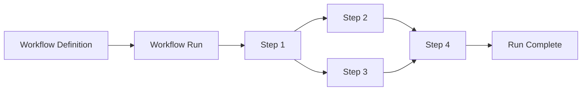
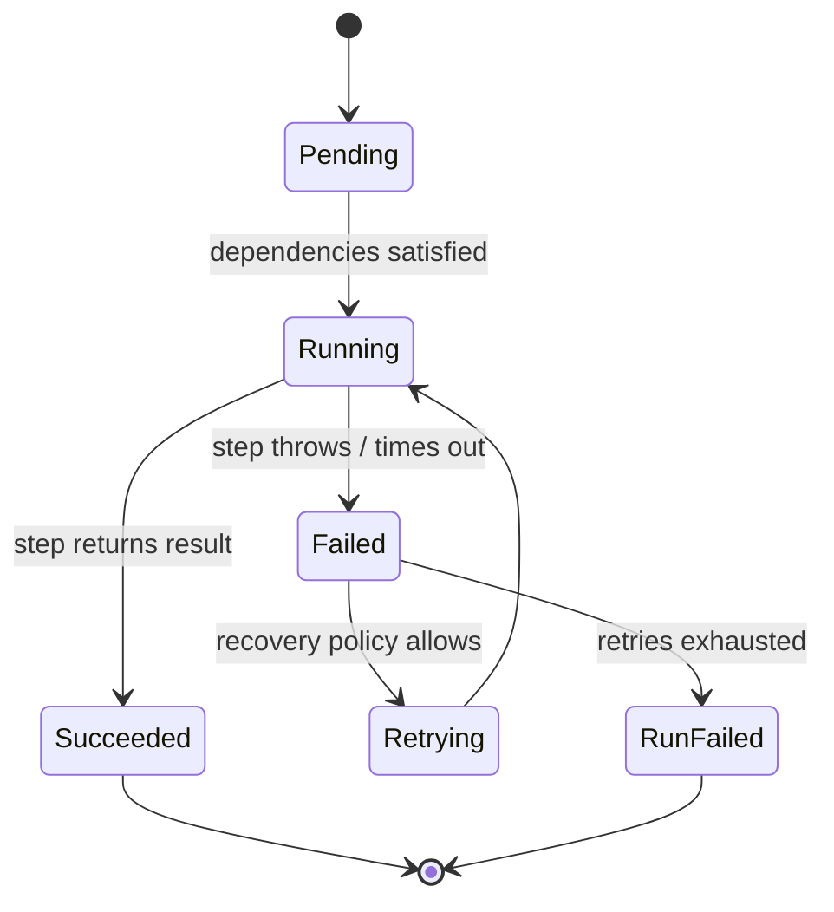
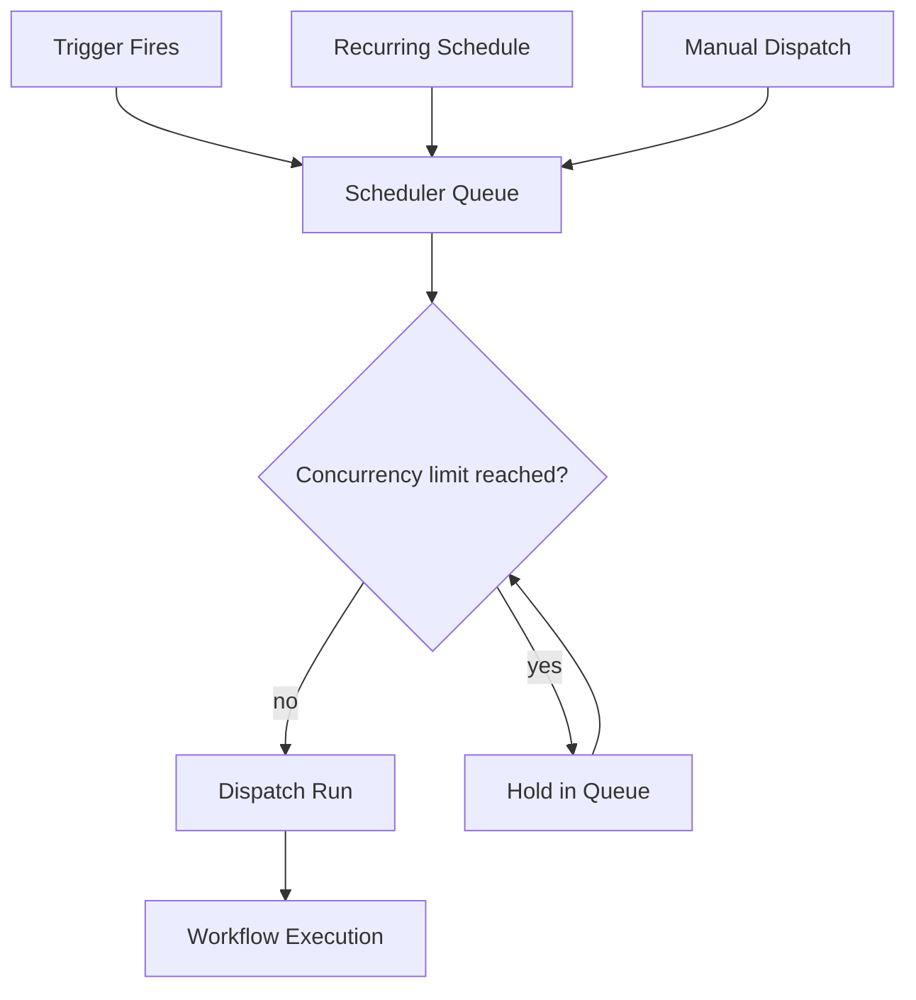
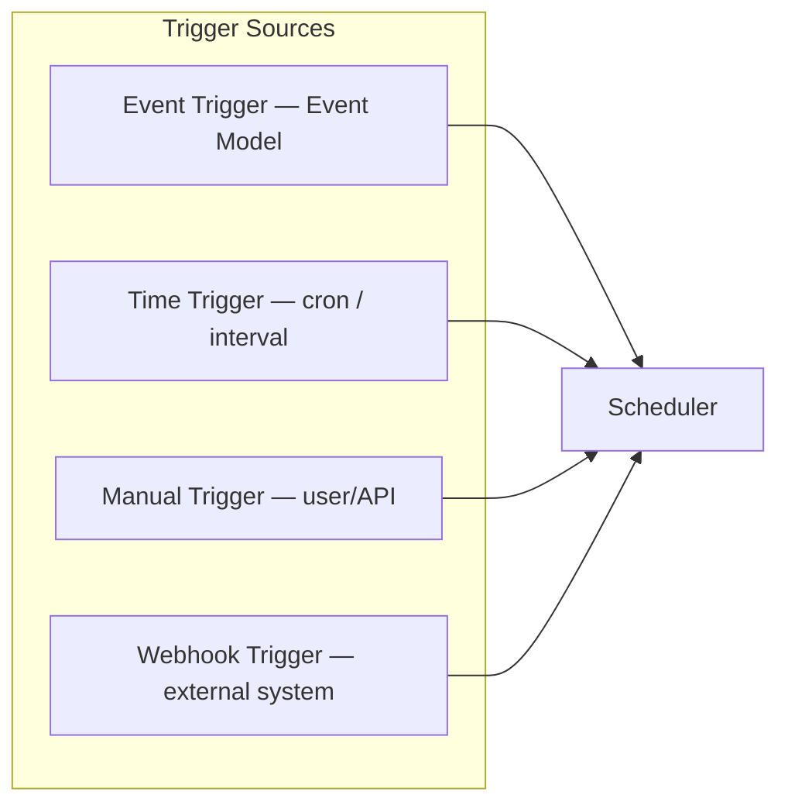
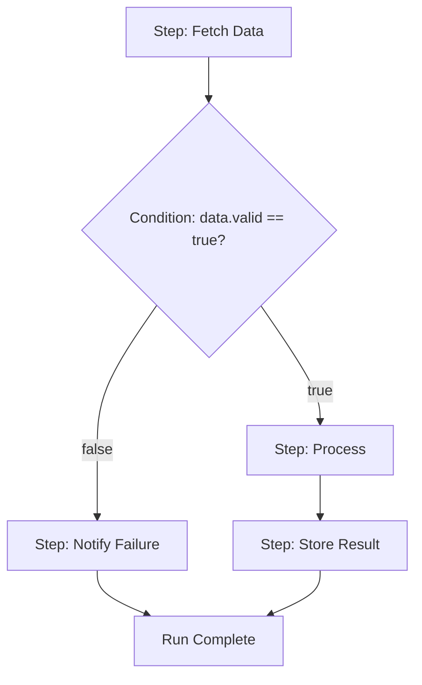
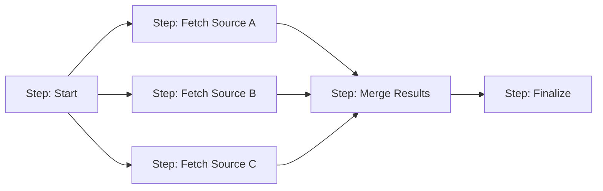
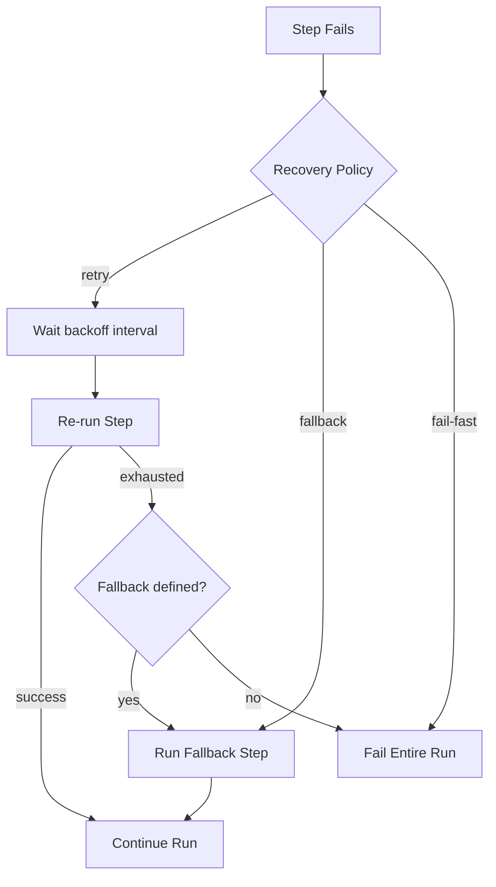
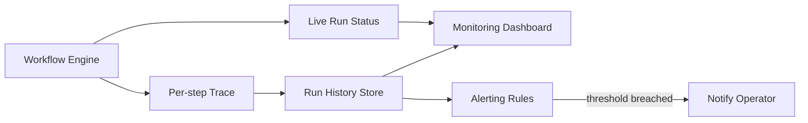

# 110_Workflow_Engine

Status: Draft

Version: 0.1

Owner: PAIOS

---

## Goal

The Workflow Engine orchestrates multi-step, multi-plugin operations over
time: it schedules work, reacts to triggers, evaluates conditions, runs
independent steps in parallel, recovers from partial failure, and exposes
what it's doing to operators. It is the layer above individual capability
calls (`030_Capability_Model.md`) and plugin actions (`100_Plugin_SDK.md`)
— where the Capability Model answers "can this be done," the Workflow
Engine answers "in what order, on what schedule, and what happens if it
fails."

---

## Scope

In scope:

- Workflow execution model and step semantics.
- The scheduler that decides when a workflow run starts.
- Triggers that initiate workflows (event-driven, time-driven, manual).
- Conditions that gate or branch execution within a workflow.
- Parallel execution of independent steps.
- Recovery from step and run failures.
- Monitoring and observability of running and historical workflows.

Out of scope:

- The internals of individual capabilities invoked by a step
  (`030_Capability_Model.md`).
- Event delivery mechanics (`040_Event_Model.md`) — the Workflow Engine is
  a consumer of events, not their transport.
- Plugin sandboxing (`100_Plugin_SDK.md`) — steps execute through the
  Plugin SDK's mediated APIs like any other plugin call.

---

## Design

### Workflow execution

A workflow is a directed graph of steps. Each step invokes a capability (a
plugin action, a prompt build, a storage operation, etc.) and produces a
result that downstream steps may consume. The engine walks the graph,
executing each step once its dependencies are satisfied.

Each step is a pure unit of work from the engine's point of view: given the
same inputs (upstream step outputs plus workflow context), it is expected
to be safely retryable. Steps declare their inputs and outputs explicitly
so the engine can compute the dependency graph without executing anything.

### Scheduler

The scheduler decides *when* a workflow definition becomes a run. It
supports immediate dispatch (trigger fires now), delayed dispatch (run at
a future time), and recurring dispatch (cron-like schedules), and it
enforces per-workflow concurrency limits so a slow recurring workflow
cannot pile up overlapping runs.

The scheduler is the single writer of run state transitions (`queued` →
`dispatched`); this avoids double-dispatch races when multiple trigger
sources fire close together for the same workflow.

### Triggers

Triggers are the entry points that create a queued run. A workflow
definition may declare more than one trigger, and any one of them is
sufficient to start a run.

- **Event trigger** — subscribes to a topic on the Event Model
  (`040_Event_Model.md`); a matching event enqueues a run with the event
  payload as initial workflow context.
- **Time trigger** — a cron expression or fixed interval, evaluated by the
  scheduler itself.
- **Manual trigger** — an explicit dispatch via API or UI, carrying
  caller-supplied input.
- **Webhook trigger** — an authenticated external call mapped to a
  workflow, validated before it reaches the scheduler queue.

### Conditions

Conditions gate whether a step runs and which branch of the graph is taken.
They are evaluated against the accumulated workflow context (trigger
payload plus prior step outputs) and must be side-effect-free.

A condition failing to evaluate (missing field, type mismatch) is treated
as a step failure, not a silent `false` — this keeps branching decisions
auditable and prevents a malformed condition from quietly skipping
important work.

### Parallel execution

Steps with no dependency relationship between them run concurrently. The
engine computes the ready set from the dependency graph at each tick and
dispatches all ready steps together, subject to a per-run concurrency cap.

A join step (like `Merge Results` above) only becomes ready once every one
of its declared upstream steps has reached a terminal state; if any
upstream branch fails and the workflow has no recovery path for it, the
join step is skipped and the run fails rather than proceeding on partial
data.

### Recovery

Failures are expected, not exceptional. Each step declares a recovery
policy: retry (with backoff and a max attempt count), fallback (run an
alternate step), or fail-fast (fail the whole run immediately).

Run-level recovery also covers engine crashes: in-flight run state is
checkpointed after every step transition, so on restart the engine resumes
each affected run from its last completed step rather than from the
beginning.

### Monitoring

Every run emits structured status and timing data, queryable live and
retained for historical audit. This is the primary way operators answer
"is this workflow healthy" and "why did this specific run fail."

Tracked per run: trigger source, per-step start/end time and status,
retry counts, final outcome, and the full input/output of failed steps
(subject to the same safety redaction used elsewhere in PAIOS, per
`090_Prompt_Builder.md`'s safety stage, when step data includes prompt
content). Alerting rules watch aggregate signals — failure rate over time,
runs stuck in `Running` past an expected duration — rather than requiring
an operator to poll individual runs.

---

## Interfaces

- `WorkflowEngine.dispatch(workflowId, input) -> RunId` — manual dispatch
  entry point, also used internally by the scheduler.
- `WorkflowEngine.getRun(runId) -> RunStatus` — live or historical run
  status, including per-step trace.
- `Scheduler.registerTrigger(workflowId, trigger)` — attaches an event,
  time, or webhook trigger to a workflow definition.
- `Step.execute(context) -> StepResult` — the contract every step
  implementation fulfills; `context` includes trigger payload and upstream
  step outputs.
- `RecoveryPolicy` — `{ mode: "retry"|"fallback"|"fail-fast", maxAttempts,
  backoff, fallbackStep? }`, attached per step.

---

## Future Work

- Dynamic (runtime-generated) step graphs for workflows whose shape
  depends on early step output rather than being fully static.
- Cross-workflow dependencies (one workflow triggering and awaiting
  another as a first-class step type).
- Cost- and latency-aware scheduling that accounts for AI Router
  (`080_AI_Router.md`) provider load when dispatching prompt-invoking steps.

---

This concludes the initial architecture documentation for PAIOS, spanning
the Core Kernel, Context Pipeline, Capability Model, Event Model, Memory
Model, Knowledge Graph, Storage Architecture, AI Router, Prompt Builder,
Plugin SDK, and Workflow Engine (`010`–`110`). Together these documents
describe a complete first pass through the system: how PAIOS represents
state, decides what it is allowed to do, talks to models, is extended by
plugins, and orchestrates work over time. Subsequent documents should
build on this baseline rather than re-deriving it, and any change to a
foundational contract described here should be reflected back into the
relevant `0X0_*` document as part of the same change.
</content>
